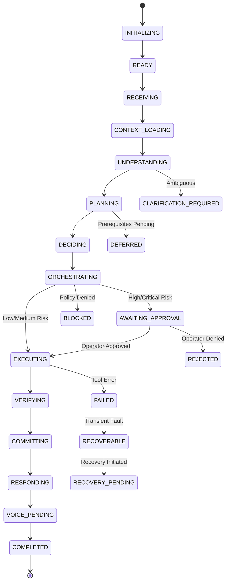

# BOWCON V4.0 — AGENT STATE & LIFECYCLE MANAGEMENT FOUNDATION
# NỀN TẢNG QUẢN LÝ TRẠNG THÁI & VÒNG ĐỜI AGENT

**Document ID:** `BOWCON-V4-DOC-LIFECYCLE-1.3.13`  
**Milestone:** `MS-1.3.13`  
**Package:** `@bow/agent` (Version `4.0.0` STRICTLY LOCKED)  
**Security Governance:** ISO/IEC 42001, PDP Level 4 Autonomous Governance  
**Languages:** English & Tiếng Việt (Bilingual Developer Reference)

---

## 1. Architecture Overview
## Tổng quan Kiến trúc

### English
The Agent State & Lifecycle Management subsystem (`src/core/lifecycle/`) provides an authoritative, machine-verifiable, and deterministic state tracking layer across the agent request execution lifecycle. While previous milestones (MS-1.3.8 through MS-1.3.12) established the cognitive progression from intent parsing to governed tool execution, MS-1.3.13 formalizes:
1. **What state is the Agent currently in?**
2. **What state was it previously in?**
3. **Is a requested transition legal?**
4. **Why did the transition happen?**
5. **Can the state be safely recovered or checkpointed?**

The lifecycle subsystem is strictly a **state control and accounting layer**. It does not execute actions, invoke PDP, consume tokens, modify persistent stores, or run external network/hardware calls.

### Tiếng Việt
Phân hệ Quản lý Trạng thái & Vòng đời Agent (`src/core/lifecycle/`) cung cấp một tầng theo dõi trạng thái có thẩm quyền, có thể xác minh bằng máy và hoàn toàn tất định xuyên suốt vòng đời xử lý yêu cầu của agent. Trong khi các milestone trước (từ MS-1.3.8 đến MS-1.3.12) đã thiết lập chuỗi nhận thức từ phân tích ý định đến thực thi công cụ có quản trị, MS-1.3.13 chuẩn hóa:
1. **Agent hiện đang ở trạng thái nào?**
2. **Trước đó Agent ở trạng thái nào?**
3. **Bước chuyển trạng thái được yêu cầu có hợp lệ không?**
4. **Tại sao việc chuyển trạng thái lại diễn ra?**
5. **Trạng thái có thể phục hồi an toàn hoặc tạo checkpoint không?**

Phân hệ vòng đời hoàn toàn là một **tầng kiểm soát và hạch toán trạng thái**. Phân hệ không thực thi hành động, không gọi PDP, không tiêu thụ token, không thay đổi kho lưu trữ bền vững, và không thực hiện các cuộc gọi mạng hoặc phần cứng bên ngoài.

---

## 2. Lifecycle States
## Các Trạng thái Vòng đời



### English
The lifecycle states are partitioned into two main categories:
1. **Operational States:** Progressive execution stages (`INITIALIZING`, `READY`, `RECEIVING`, `CONTEXT_LOADING`, `UNDERSTANDING`, `PLANNING`, `DECIDING`, `ORCHESTRATING`, `AWAITING_APPROVAL`, `EXECUTING`, `VERIFYING`, `COMMITTING`, `RESPONDING`, `VOICE_PENDING`, `COMPLETED`).
2. **Terminal & Controlled Exit States:** Branched or final outcomes (`NO_ACTION`, `CLARIFICATION_REQUIRED`, `DEFERRED`, `BLOCKED`, `REJECTED`, `FAILED`, `RECOVERABLE`, `RECOVERY_PENDING`, `CANCELLED`).

### Tiếng Việt
Các trạng thái vòng đời được chia thành hai nhóm chính:
1. **Trạng thái Hoạt động:** Các giai đoạn thực thi lũy tiến (`INITIALIZING`, `READY`, `RECEIVING`, `CONTEXT_LOADING`, `UNDERSTANDING`, `PLANNING`, `DECIDING`, `ORCHESTRATING`, `AWAITING_APPROVAL`, `EXECUTING`, `VERIFYING`, `COMMITTING`, `RESPONDING`, `VOICE_PENDING`, `COMPLETED`).
2. **Trạng thái Kết thúc & Thoát có kiểm soát:** Các nhánh rẽ hoặc kết quả cuối cùng (`NO_ACTION`, `CLARIFICATION_REQUIRED`, `DEFERRED`, `BLOCKED`, `REJECTED`, `FAILED`, `RECOVERABLE`, `RECOVERY_PENDING`, `CANCELLED`).

---

## 3. State Transitions & Validation
## Chuyển Trạng thái & Xác thực Chuyển đổi

### English
Every state transition is checked against the immutable transition matrix `VALID_TRANSITIONS`.
- **No Arbitrary Jumps (INV-STATE-05):** For example, `INITIALIZING` cannot jump directly to `EXECUTING`; `RECEIVING` cannot jump directly to `COMMITTING`.
- **Monotonic Risk Preservation (INV-STATE-07):** A transition can escalate risk (`LOW` -> `HIGH`), but can **never** downgrade risk (`CRITICAL` -> `HIGH`, `HIGH` -> `LOW`).
- **Governance Non-Downgrade (INV-STATE-08, INV-STATE-09):** Once `governanceRequired` or `approvalRequired` is marked `true`, subsequent transitions cannot reset them to `false`.

### Tiếng Việt
Mọi bước chuyển trạng thái đều được kiểm tra đối chiếu với bảng ma trận chuyển đổi bất biến `VALID_TRANSITIONS`.
- **Không Nhảy cóc Tùy ý (INV-STATE-05):** Ví dụ, `INITIALIZING` không thể nhảy thẳng sang `EXECUTING`; `RECEIVING` không thể nhảy thẳng sang `COMMITTING`.
- **Bảo tồn Rủi ro Đơn điệu (INV-STATE-07):** Một bước chuyển có thể nâng cấp mức độ rủi ro (`LOW` -> `HIGH`), nhưng **tuyệt đối không bao giờ** được hạ cấp rủi ro (`CRITICAL` -> `HIGH`, `HIGH` -> `LOW`).
- **Không Hạ cấp Quản trị (INV-STATE-08, INV-STATE-09):** Một khi `governanceRequired` hoặc `approvalRequired` đã được đánh dấu là `true`, các bước chuyển tiếp theo không được phép đặt lại về `false`.

---

## 4. Terminal State Protection
## Bảo vệ Trạng thái Kết thúc

### English
Terminal states represent the conclusion of a request lifecycle:
- `COMPLETED` (Normal successful completion)
- `REJECTED` (Governance approval rejected)
- `BLOCKED` (Policy gate blocked fail-closed)
- `CANCELLED` (Client aborted or session closed)

**Invariant (INV-STATE-06):** Terminal states have **zero** valid outgoing transitions. Any attempt to transition out of a terminal state throws `TERMINAL_STATE_LOCKED`. A new lifecycle sequence requires an explicit new session initialization.

### Tiếng Việt
Các trạng thái kết thúc đại diện cho điểm dừng của một vòng đời yêu cầu:
- `COMPLETED` (Hoàn thành thành công thông thường)
- `REJECTED` (Bị từ chối phê duyệt quản trị)
- `BLOCKED` (Bị chặn fail-closed bởi cổng chính sách)
- `CANCELLED` (Khách hàng hủy hoặc đóng phiên)

**Quy tắc bất biến (INV-STATE-06):** Các trạng thái kết thúc có **không (0)** bước chuyển hợp lệ ra ngoài. Bất kỳ nỗ lực nào nhằm chuyển trạng thái ra khỏi một trạng thái kết thúc đều ném ngoại lệ `TERMINAL_STATE_LOCKED`. Một chu trình vòng đời mới đòi hỏi phải khởi tạo phiên mới một cách tường minh.

---

## 5. Failure Classification & Recovery Model
## Phân loại Sự cố & Mô hình Phục hồi

### English
Failures are captured using structured `FailureMetadata`:
- **Categories:** `VALIDATION_FAILURE`, `CONTEXT_FAILURE`, `INTENT_FAILURE`, `PLANNING_FAILURE`, `DECISION_FAILURE`, `ORCHESTRATION_FAILURE`, `AUTHORIZATION_FAILURE`, `EXECUTION_FAILURE`, `VERIFICATION_FAILURE`, `COMMIT_FAILURE`, `VOICE_FAILURE`, `INTERNAL_FAILURE`.
- **Secret Redaction:** Raw messages are sanitized via `redactLifecycleSecrets`.
- **Recovery Metadata (INV-STATE-14):** A pure data descriptor (`RecoveryMetadata`) indicating whether recovery is permitted (`recoverable`, `retryAllowed`, `attemptNumber <= maxAttempts`). It **never** executes retries, network requests, or timeouts on its own.

### Tiếng Việt
Sự cố được ghi nhận thông qua đối tượng có cấu trúc `FailureMetadata`:
- **Danh mục:** `VALIDATION_FAILURE`, `CONTEXT_FAILURE`, `INTENT_FAILURE`, `PLANNING_FAILURE`, `DECISION_FAILURE`, `ORCHESTRATION_FAILURE`, `AUTHORIZATION_FAILURE`, `EXECUTION_FAILURE`, `VERIFICATION_FAILURE`, `COMMIT_FAILURE`, `VOICE_FAILURE`, `INTERNAL_FAILURE`.
- **Khử trùng Bí mật:** Nội dung thông báo thô được làm sạch qua `redactLifecycleSecrets`.
- **Metadata Phục hồi (INV-STATE-14):** Bộ mô tả thuần dữ liệu (`RecoveryMetadata`) chỉ định xem việc phục hồi có được phép hay không (`recoverable`, `retryAllowed`, `attemptNumber <= maxAttempts`). Bộ mô tả **tuyệt đối không** tự ý thực thi retry, gọi mạng hay dùng timeout.

---

## 6. Immutable Checkpoints
## Điểm Kiểm tra (Checkpoint) Bất biến

### English
Checkpoints capture deterministic snapshots of the agent lifecycle:
```typescript
const checkpoint = service.createCheckpoint(userId, sessionId, correlationId, safeMetadata);
```
- **Snapshot Immutability (INV-STATE-02):** The returned `LifecycleCheckpoint` is deeply frozen with `Object.freeze()`.
- **Zero Memory Mutation (INV-STATE-15):** Creating a checkpoint does not write to durable storage, does not modify conversation turns, and produces zero side effects.

### Tiếng Việt
Checkpoint ghi lại snapshot tất định của vòng đời agent:
- **Bất biến Snapshot (INV-STATE-02):** Đối tượng `LifecycleCheckpoint` trả về được đóng băng sâu bằng `Object.freeze()`.
- **Không Biến đổi Bộ nhớ (INV-STATE-15):** Việc tạo checkpoint không ghi vào bộ nhớ bền vững, không sửa đổi các lượt hội thoại và không tạo bất kỳ tác dụng phụ nào.

---

## 7. Deterministic Fingerprinting
## Dấu Vân tay (Fingerprinting) Tất định

### English
All state identities, transitions, checkpoints, and failure events are fingerprinted using a non-random 32-bit FNV-1a hashing function:
- `state_<hash>`: Bound to `userId`, `sessionId`, `state`, `sequence`, `riskLevel`, and `correlationId`.
- `transition_<hash>`: Bound to `userId`, `sessionId`, `from`, `to`, `sequence`, and `reason`.
- `checkpoint_<hash>`: Bound to `userId`, `sessionId`, `state`, `sequence`, and `correlationId`.
- `failure_<hash>`: Bound to `userId`, `sessionId`, `category`, `stage`, and `state`.

Zero usage of `Math.random()`, `crypto.randomUUID()`, or current timestamps for identity.

### Tiếng Việt
Mọi định danh trạng thái, bước chuyển, checkpoint và sự kiện lỗi đều được tạo fingerprint bằng thuật toán băm FNV-1a 32-bit phi ngẫu nhiên:
- `state_<hash>`: Ràng buộc vào `userId`, `sessionId`, `state`, `sequence`, `riskLevel`, và `correlationId`.
- `transition_<hash>`: Ràng buộc vào `userId`, `sessionId`, `from`, `to`, `sequence`, và `reason`.
- `checkpoint_<hash>`: Ràng buộc vào `userId`, `sessionId`, `state`, `sequence`, và `correlationId`.
- `failure_<hash>`: Ràng buộc vào `userId`, `sessionId`, `category`, `stage`, và `state`.

Tuyệt đối không sử dụng `Math.random()`, `crypto.randomUUID()`, hay timestamp hiện tại để làm định danh.

---

## 8. Multi-Tenant User & Session Isolation
## Cô lập Đa Người dùng & Phiên

### English
State is strictly isolated using `${userId}::${sessionId}` keys:
- User Alice cannot access, observe, or mutate User Bob's state.
- Multiple concurrent sessions belonging to the same user remain completely distinct.
- Anonymous scopes (`anon`, `anonymous`, empty, whitespace) are rejected fail-closed with `DISALLOWED_USER_SCOPE`.

### Tiếng Việt
Trạng thái được cô lập nghiêm ngặt bằng khóa `${userId}::${sessionId}`:
- Người dùng Alice không thể truy cập, quan sát hay thay đổi trạng thái của Người dùng Bob.
- Nhiều phiên hoạt động đồng thời của cùng một người dùng hoàn toàn tách biệt nhau.
- Các phạm vi ẩn danh (`anon`, `anonymous`, chuỗi rỗng, khoảng trắng) đều bị từ chối dứt khoát theo cơ chế fail-closed với mã `DISALLOWED_USER_SCOPE`.

---

## 9. Invariant Matrix Checklist
## Danh mục Kiểm toán Quy tắc Bất biến

| Invariant | Description / Mô tả | Enforcement / Cơ chế Thực thi |
|---|---|---|
| **INV-STATE-01** | No invalid transitions | `assertValidTransition` against `VALID_TRANSITIONS` matrix |
| **INV-STATE-02** | No mutation after creation | `Object.freeze()` applied deeply to all state and checkpoint objects |
| **INV-STATE-03** | No user/session cross-talk | Scoped session map keyed by `${userId}::${sessionId}` |
| **INV-STATE-04** | No secret persistence | `redactLifecycleSecrets` and `containsLifecycleSecret` checks |
| **INV-STATE-05** | No arbitrary lifecycle jumps | Strict forward pipeline paths; illegal jumps throw Error |
| **INV-STATE-06** | No terminal-state bypass | `COMPLETED`, `REJECTED`, `BLOCKED`, `CANCELLED` have 0 outgoing transitions |
| **INV-STATE-07** | No risk downgrade | `assertRiskPreservation` rejects downgrading risk levels |
| **INV-STATE-08** | No governance downgrade | `assertGovernancePreservation` ensures `governanceRequired` cannot be cleared |
| **INV-STATE-09** | No approval requirement removal | `assertGovernancePreservation` ensures `approvalRequired` cannot be cleared |
| **INV-STATE-10** | State != Action | Entering `EXECUTING` does not invoke or trigger any tool handler |
| **INV-STATE-11** | Deterministic fingerprints | FNV-1a 32-bit hashing over normalized string tokens |
| **INV-STATE-12** | Immutable transition records | `TransitionRecord` frozen and preserved in session audit history |
| **INV-STATE-13** | Failure isolation | Structured errors do not crash agent loop; categorized fail-closed |
| **INV-STATE-14** | Recovery cannot execute | `RecoveryMetadata` is pure data; no retries, loops, or timeouts |
| **INV-STATE-15** | Zero external side effects | No network, filesystem writes, hardware, or external API dependencies |

---

## 10. Developer Examples
## Ví dụ cho Lập trình viên

### Legal Lifecycle Progression / Chu trình Hợp lệ
```typescript
import { LifecycleService } from '@bow/agent';

const service = new LifecycleService();
const userId = 'boss_user';
const sessionId = 'session_prod_01';

// 1. Initialize session in READY state
service.getOrCreateSession(userId, sessionId, 'READY');

// 2. Receive query and load context
service.transition(userId, sessionId, 'RECEIVING', 'User query received');
service.transition(userId, sessionId, 'CONTEXT_LOADING', 'Loading working memory');

// 3. Understand and plan
service.transition(userId, sessionId, 'UNDERSTANDING', 'Classified intent ORDER_QUERY');
service.transition(userId, sessionId, 'PLANNING', 'Synthesized candidate plan');

// 4. Decide and orchestrate
service.transition(userId, sessionId, 'DECIDING', 'Action selected with confidence 0.95');
service.transition(userId, sessionId, 'ORCHESTRATING', 'Prepared governed execution request');

// 5. Execute and verify
service.transition(userId, sessionId, 'EXECUTING', 'Tool capability dispatched');
service.transition(userId, sessionId, 'VERIFYING', 'Auditing output payload');

// 6. Commit, respond, and complete
service.transition(userId, sessionId, 'COMMITTING', 'Turn persisted to memory');
service.transition(userId, sessionId, 'RESPONDING', 'Constructed natural reply');
service.transition(userId, sessionId, 'COMPLETED', 'Lifecycle cycle ended successfully');
```

### Invalid Transitions That Throw / Các Lỗi Chuyển Đổi Bị Chặn
```typescript
// Illegal arbitrary jump (RECEIVING -> COMMITTING)
// Throws: ILLEGAL_TRANSITION: Cannot transition directly from "RECEIVING" to "COMMITTING".
service.transition(userId, sessionId, 'COMMITTING', 'Skipping stages');

// Illegal restart from terminal state (COMPLETED -> EXECUTING)
// Throws: TERMINAL_STATE_LOCKED: Current state "COMPLETED" is terminal.
service.transition(userId, sessionId, 'EXECUTING', 'Restart attempt');

// Illegal risk downgrade (HIGH -> LOW)
// Throws: RISK_DOWNGRADE_FORBIDDEN: Cannot downgrade risk from "HIGH" to "LOW".
service.transition(userId, sessionId, 'RECEIVING', 'Downgrade', { riskLevel: 'LOW' });
```
