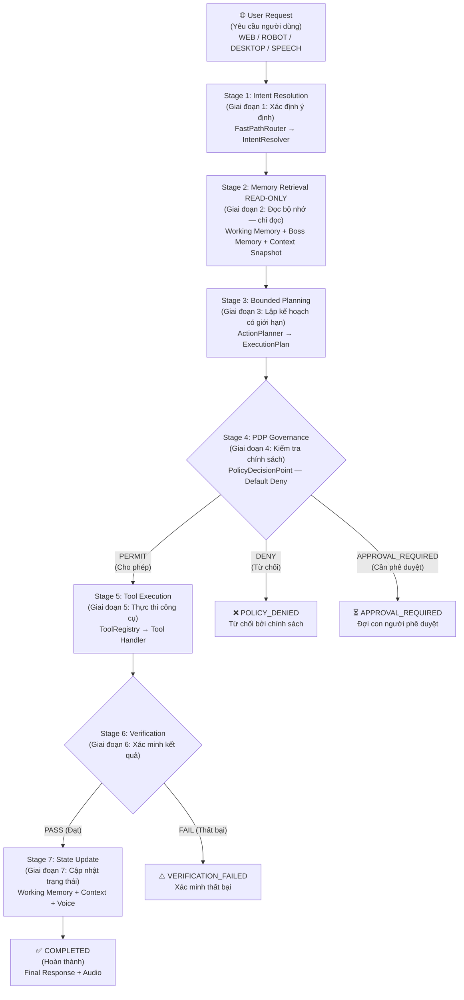
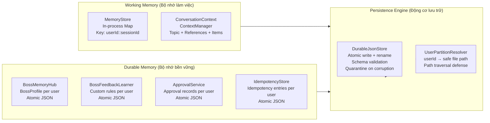
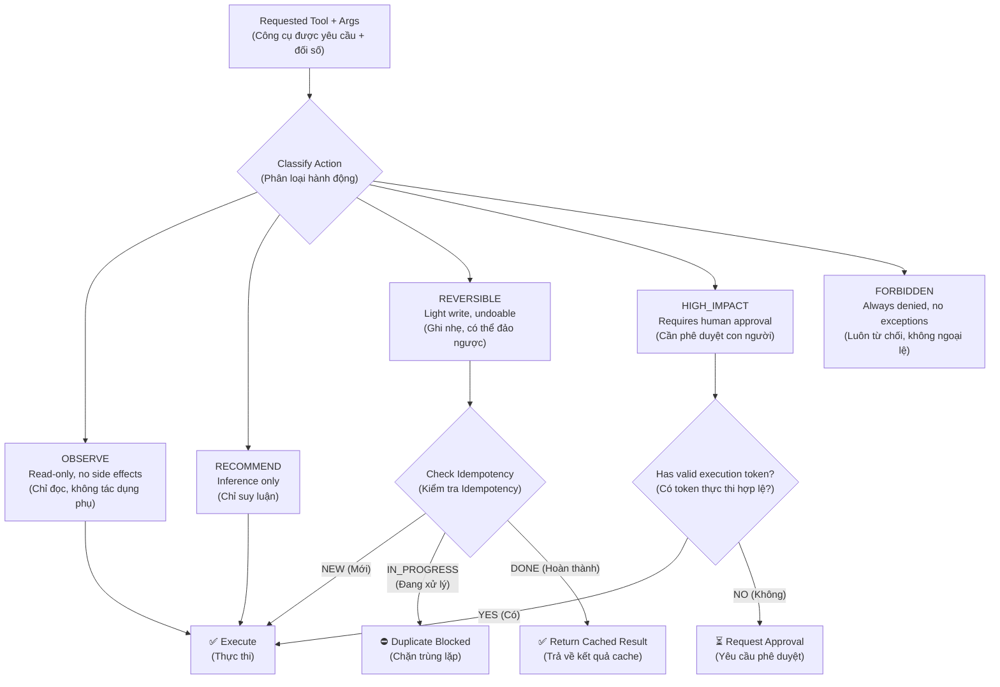
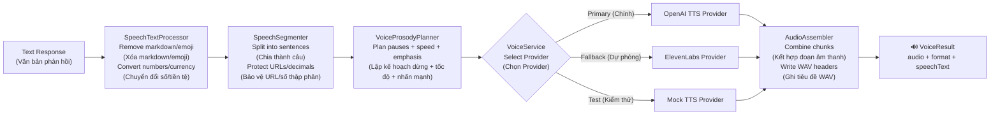
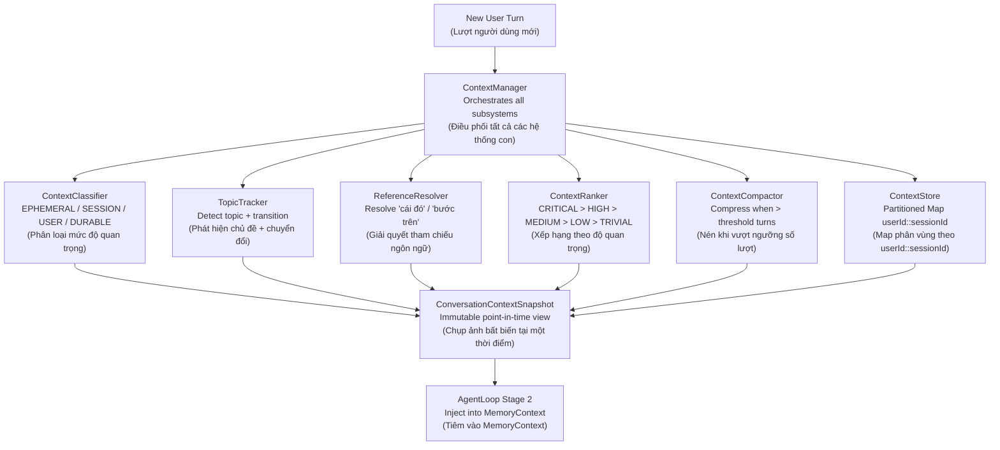

# BOWCON V4.0 — ARCHITECTURE FLOW DIAGRAM (BILINGUAL)
# Sơ Đồ Luồng Kiến Trúc (Song Ngữ)

---

## 1. REQUEST LIFECYCLE / VÒNG ĐỜI YÊU CẦU



---

## 2. MEMORY ARCHITECTURE / KIẾN TRÚC BỘ NHỚ



---

## 3. GOVERNANCE / PDP FLOW / LUỒNG PDP



---

## 4. VOICE PIPELINE / LUỒNG XỬ LÝ GIỌNG NÓI



---

## 5. CONTEXT SUBSYSTEM / HỆ THỐNG NGỮ CẢNH



---

## 6. DATA ISOLATION BOUNDARIES / RANH GIỚI CÔ LẬP DỮ LIỆU

```
┌─────────────────────────────────────────────────────────────────┐
│  User A                                                         │
│  ┌─────────────────────────────────────────────────────────┐   │
│  │  Session A-1                    Session A-2              │   │
│  │  WorkingMemory[A::A-1]          WorkingMemory[A::A-2]   │   │
│  │  ContextStore[A::A-1]           ContextStore[A::A-2]    │   │
│  └─────────────────────────────────────────────────────────┘   │
│  DurableMemory[A] → data/users/A/bossMemory.json               │
│  Approvals[A]    → data/approvals/A/approvals.json             │
└─────────────────────────────────────────────────────────────────┘

┌─────────────────────────────────────────────────────────────────┐
│  User B  ← COMPLETELY ISOLATED FROM User A                     │
│  ┌─────────────────────────────────────────────────────────┐   │
│  │  Session B-1                                             │   │
│  │  WorkingMemory[B::B-1]                                  │   │
│  │  ContextStore[B::B-1]                                   │   │
│  └─────────────────────────────────────────────────────────┘   │
│  DurableMemory[B] → data/users/B/bossMemory.json               │
│  Approvals[B]    → data/approvals/B/approvals.json             │
└─────────────────────────────────────────────────────────────────┘
```

---

*Generated as part of BOWCON V4.0 Bilingual Documentation Pass*
*Được tạo như một phần của Tài liệu Song Ngữ BOWCON V4.0*
