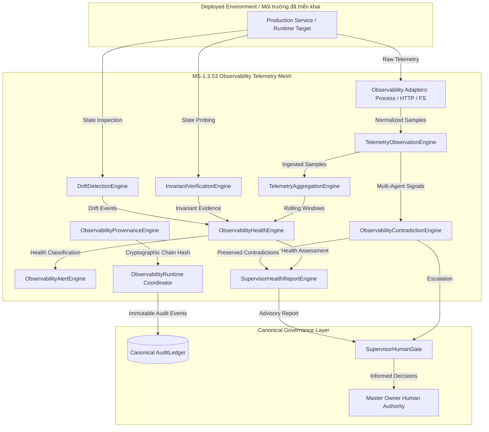

# BOWCON V4.0 — MILESTONE 1.3.53 SPECIFICATION & ARCHITECTURE
# GOVERNED POST-DEPLOYMENT AUTONOMOUS VERIFICATION, DRIFT DETECTION & OBSERVABILITY TELEMETRY MESH
# LƯỚI ĐO TỪ XA QUAN SÁT, XÁC MINH TỰ ĐỘNG & PHÁT HIỆN SAI LỆCH SAU TRIỂN KHAI CÓ QUẢN TRỊ

---

## 1. EXECUTIVE SUMMARY / TÓM TẮT ĐIỀU HÀNH

**English:**  
Milestone 1.3.53 establishes the post-deployment autonomous observation, verification, drift detection, and advisory reporting mesh for the BOWCON V4.0 governance architecture. While MS-1.3.52 controls governed production deployment and canary execution, MS-1.3.53 extends this boundary to ensure systems remain continuously verified, invariant-compliant, and free of unauthorized drift after deployment. Critically, this milestone creates observation, detection, and advisory reporting capabilities—it **never creates autonomous mutation or production repair authority**. All operational authority strictly remains with the Master Owner and the Supervisor Human Gate.

**Tiếng Việt:**  
Mốc 1.3.53 thiết lập lưới đo từ xa quan sát, xác minh tự động, phát hiện sai lệch và báo cáo khuyến nghị sau triển khai cho kiến trúc quản trị BOWCON V4.0. Trong khi MS-1.3.52 kiểm soát việc triển khai sản xuất có quản trị và thực thi canary, MS-1.3.53 mở rộng ranh giới này để đảm bảo các hệ thống liên tục được xác minh, tuân thủ bất biến và không có sai lệch trái phép sau khi triển khai. Quan trọng nhất, mốc này tạo ra khả năng quan sát, phát hiện và báo cáo khuyến nghị—nó **không bao giờ tạo ra quyền sửa chữa sản xuất hoặc đột biến tự động**. Mọi thẩm quyền vận hành hoàn toàn thuộc về Chủ sở hữu Tối cao (Master Owner) và Cổng Giám sát Con người (Supervisor Human Gate).

---

## 2. STRICT INVARIANTS & AUTHORITY HIERARCHY / CÁC BẤT BIẾN NGHIÊM NGẶT & THỨ BẬC QUYỀN LỰC

```
MASTER_OWNER_AUTHORITY > BOW > BOWCON > PROJECTS
OWNER_DECISION > BOWCON_RECOMMENDATION
USER_STOP > EVERYTHING_AUTONOMOUS
REVOCATION > AGENT_INTENT
AUTOMATION != OWNER_WILL
OBSERVATION != INTERPRETATION
INTERPRETATION != AUTHORITY
HEALTH != AUTHORITY
DRIFT_DETECTION != AUTHORIZATION
TELEMETRY != AUTHORIZATION
ALERT != OWNER_APPROVAL
RECOMMENDATION != EXECUTION
AGENT_COUNT != AUTHORITY_COUNT
MONITORING_RESULT != EXECUTION_PERMISSION
SUPERVISOR_HEALTH_REPORT != OWNER_APPROVAL
C:\BOW\shopofbow: READS = 0, WRITES = 0, IMPORTS = 0, TOUCHES = 0 (PROTECTED_WORKSPACE_VIOLATION)
```

**Key Architectural Separation / Phân tách kiến trúc cốt lõi:**
1. **OBSERVATION (Quan sát):** Collecting raw telemetry signals, probes, and metrics deterministically.
2. **INTERPRETATION (Giải thích):** Normalizing signals, detecting drift, evaluating invariants, and classifying health states (`HEALTHY`, `DEGRADED`, `UNSTABLE`, `UNKNOWN`, `CRITICAL`).
3. **RECOMMENDATION (Khuyến nghị):** Compiling advisory supervisor reports and non-binding alerts.
4. **ESCALATION (Thăng cấp):** Routing unresolved contradictions, invariant violations, and critical drift directly to `SupervisorHumanGate`.
5. **ZERO AUTONOMOUS PRODUCTION REPAIR:** Drift detection NEVER repairs production state autonomously. The mandatory workflow is:
   `OBSERVE -> CLASSIFY -> RECORD -> REPORT -> ESCALATE`.

---

## 3. ARCHITECTURAL PIPELINE / ĐƯỜNG ỐNG KIẾN TRÚC



---

## 4. SUBSYSTEM COMPONENTS / CÁC THÀNH PHẦN HỆ THỐNG CON

| Component / Thành phần | File Path / Đường dẫn | Reality / Thực tế | Role & Governance Responsibilities / Vai trò & Trách nhiệm Quản trị |
| :--- | :--- | :---: | :--- |
| `ObservabilityTypes` | `src/core/observability/observabilityTypes.ts` | **REAL** | Branded IDs (`ObservationId`, `TelemetrySampleId`, `HealthCheckId`, etc.), state machines (`ObservabilitySessionState`), non-authoritative health classifications. |
| `TelemetryObservationEngine` | `src/core/observability/telemetryObservationEngine.ts` | **REAL** | Ingests and normalizes raw telemetry (errorRate, latency, availability, health probes, version, manifest); computes deterministic SHA-256 evidence hashes; scrubs secrets. |
| `TelemetryAggregationEngine` | `src/core/observability/telemetryAggregationEngine.ts` | **REAL** | Aggregates point samples into deterministic rolling observation windows; calculates weighted averages; detects consecutive degradation streaks; baseline comparisons. |
| `InvariantVerificationEngine` | `src/core/observability/invariantVerificationEngine.ts` | **REAL** | Continuously verifies declared system invariants (manifest integrity, protected workspace isolation, boundaries, probes, USER_STOP, REVOCATION). |
| `DriftDetectionEngine` | `src/core/observability/driftDetectionEngine.ts` | **REAL** | Deterministically detects filesystem, configuration, manifest, version, and mutation drift. Classifies: `NO_DRIFT`, `EXPECTED_DRIFT`, `UNKNOWN_DRIFT`, `CRITICAL_DRIFT`. |
| `ObservabilityHealthEngine` | `src/core/observability/observabilityHealthEngine.ts` | **REAL** | Classifies overall health: `HEALTHY`, `DEGRADED`, `UNSTABLE`, `UNKNOWN`, `CRITICAL`, `OBSERVATION_UNAVAILABLE`. Health never confers execution authority. |
| `ObservabilityAlertEngine` | `src/core/observability/observabilityAlertEngine.ts` | **REAL** | Dispatches deterministic advisory notifications with SHA-256 deduplication fingerprints; assigns severities (`INFO`, `WARNING`, `HIGH`, `CRITICAL`). |
| `ObservabilityContradictionEngine` | `src/core/observability/observabilityContradictionEngine.ts` | **REAL** | Multi-agent conflict detection; strictly rejects majority voting (`AGENT_COUNT != AUTHORITY_COUNT`); preserves all conflicting assertions verbatim. |
| `SupervisorHealthReportEngine` | `src/core/observability/supervisorHealthReportEngine.ts` | **REAL** | Compiles deterministic supervisor health reports with SHA-256 reportHash. Purely advisory: `SUPERVISOR_HEALTH_REPORT != OWNER_APPROVAL`. |
| `ObservabilityProvenanceEngine` | `src/core/observability/observabilityProvenanceEngine.ts` | **REAL** | Cryptographic provenance binding across the entire lifecycle from task root to audit arguments hash; scrubs sensitive tokens, passwords, and authorization keys. |
| `ObservabilityAdapters` | `src/core/observability/observabilityAdapters.ts` | **REAL** | Extensible observational adapter model: `LocalProcessProbeAdapter`, `SyntheticHttpProbeAdapter`, `FilesystemObserverAdapter`. Strictly observational (zero mutation). |
| `ObservabilityRuntime` | `src/core/observability/observabilityRuntime.ts` | **REAL** | Central coordinator managing sessions, safety switches (`USER_STOP`, `REVOCATION`), evaluation pipelines, and canonical `AuditLedger` recording. |
| `ObservabilityRealityGate` | `tests/test_v4_agent_governed_post_deployment_observability.ts` | **REAL** | 29 automated test categories (A..AC); verifies all fail-closed states, drift detection, multi-agent contradiction preservation, and isolation invariants. |

---

## 5. SECURITY & WORKSPACE ISOLATION / BẢO MẬT & CÁCH LY KHÔNG GIAN LÀM VIỆC

1. **Zero Shell Primitives:**  
   Runtime logic strictly prohibits `eval`, `new Function`, `execSync`, `child_process`, `spawn`, `fork`, and `SSH`. Verified by automated AST/token scans in Category AC of the Reality Gate.
2. **Protected Workspace Isolation:**  
   `C:\BOW\shopofbow` remains strictly untouched (READS = 0, WRITES = 0, IMPORTS = 0, TOUCHES = 0). Any path referencing this boundary fails closed immediately with `PROTECTED_WORKSPACE_VIOLATION`.
3. **Secret Scrubbing:**  
   All tokens, API keys, passwords, and Bearer authorization headers are scrubbed (`[REDACTED]`) before evidence hashing and audit ledger persistence.
4. **Safety Circuit Breaker:**  
   `USER_STOP` or `REVOCATION` triggers immediately transition all observation sessions to `BLOCKED` or `REVOKED`, halting all further autonomous operations.
