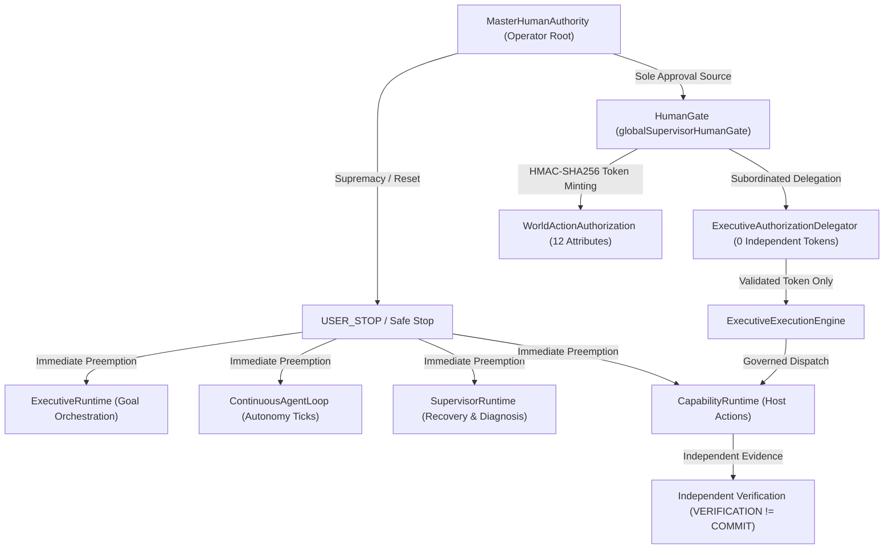

# BOWCON V4 — Master Human Authority Unification & Executive Governance Model
# Thống Nhất Thẩm Quyền Con Người Tối Cao & Quản Trị Hành Pháp

**Milestone**: `MS-1.3.38`  
**Package**: `@bow/agent@4.0.0`  
**Status**: `VERIFIED & LOCKED`  

---

## 1. Executive Summary / Tóm Tắt Điều Hành

### English
Milestone MS-1.3.38 formalizes and enforces **ONE single Master Human Authority** as the ultimate governance root for the entire BOWCON V4.0 runtime. It resolves the architectural gaps identified in MS-1.3.37 by subordinating all execution, orchestration, recovery, and authorization components to a unified human control plane. The `ExecutiveRuntime` does not operate as an independent sovereign or secondary execution engine; it owns zero independent token stores and strictly delegates authorization to the canonical `HumanGate` and `WorldActionAuthorization` systems. Cryptographic token bindings, single-use guarantees, fail-closed DAG safety, and absolute `USER_STOP` supremacy are rigidly locked into code.

### Tiếng Việt
Cột mốc MS-1.3.38 chính thức hóa và thiết lập **MỘT Thẩm Quyền Con Người Tối Cao duy nhất (Master Human Authority)** làm gốc rễ quản trị tối hậu cho toàn bộ runtime BOWCON V4.0. Cột mốc này giải quyết triệt để các khoảng trống kiến trúc từ MS-1.3.37 bằng cách đặt toàn bộ các thành phần thực thi, điều phối, khôi phục và ủy quyền dưới một mặt phẳng kiểm soát con người thống nhất. `ExecutiveRuntime` không hoạt động như một thực thể độc lập hay engine thực thi phụ; nó sở hữu 0 kho lưu trữ token độc lập và ủy quyền hoàn toàn cho hệ thống `HumanGate` và `WorldActionAuthorization` chuẩn mực. Ràng buộc token mật mã, cam kết dùng 1 lần, an toàn DAG fail-closed và quyền tối thượng tuyệt đối của `USER_STOP` được khóa chặt trong mã nguồn.

---

## 2. Core Authority Hierarchy & Invariants / Hệ Phân Cấp Thẩm Quyền & Bất Biến Cốt Lõi

### Invariant Hierarchy / Hệ Phân Cấp Bất Biến
1. `USER_STOP > HUMAN_AUTHORIZATION > GOVERNANCE > EXECUTIVE_RUNTIME > AUTONOMOUS_EXECUTION`
2. `CONFIDENCE != AUTHORIZATION` (Độ tin cậy của mô hình nhận thức không thay thế được sự ủy quyền)
3. `LLM_PROPOSE != EXECUTE` (Khuyến nghị của LLM chỉ mang tính đề xuất, không có quyền tự kích hoạt)
4. `EXECUTION != VERIFICATION` (Thực thi thành công không đồng nghĩa với xác minh độc lập đã qua)
5. `VERIFICATION != COMMIT` (Xác minh độc lập không đồng nghĩa với cam kết trạng thái bền vững)
6. `PROTECTED_WORKSPACE_INVARIANT`: `C:\BOW\shopofbow` -> `READS = 0, WRITES = 0, IMPORTS = 0, TOUCHES = 0`

---

## 3. Master Human Authority Architecture / Kiến Trúc Thẩm Quyền Con Người Tối Cao

### English
- **Master Identity Resolution**: Canonical master operator identity is `'master_operator'`, with recognized authoritative aliases (`'user_primary'`, `'operator'`, `'boss_user'`). Unrecognized or unauthenticated users are rejected with `AUTHORITY_DENIED`.
- **USER_STOP Supremacy**:
  - `triggerUserStop(reason)` halts `ExecutiveRuntime`, `ContinuousAgentLoop`, `SupervisorRuntime`, and `CapabilityRuntime`, immediately rejecting pending authorizations and scheduled tasks.
  - `resetUserStop(operatorId)` strictly requires the Master Human Authority identity. Non-master attempts fail closed with `USER_STOP_RESET_UNAUTHORIZED`.
- **Host Shell Prohibition**:
  - Strict prohibition of unrestricted host shells (`cmd.exe`, `powershell.exe`, `/bin/sh`, `/bin/bash`), dynamic code execution (`eval`, `new Function`), synchronous process blocking (`execSync`), and non-deterministic pseudo-randomness in security contexts.

### Tiếng Việt
- **Phân giải Định danh Master**: Định danh master operator chuẩn là `'master_operator'`, với các bí danh hợp lệ được công nhận (`'user_primary'`, `'operator'`, `'boss_user'`). Người dùng không xác thực hoặc không thuộc danh sách sẽ bị từ chối với lỗi `AUTHORITY_DENIED`.
- **Quyền Tối Thượng của USER_STOP**:
  - `triggerUserStop(reason)` dừng khẩn cấp `ExecutiveRuntime`, `ContinuousAgentLoop`, `SupervisorRuntime`, và `CapabilityRuntime`, lập tức hủy bỏ các yêu cầu ủy quyền đang chờ và tác vụ đã lên lịch.
  - `resetUserStop(operatorId)` bắt buộc phải do Master Human Authority thực hiện. Mọi nỗ lực từ người dùng không phải master đều bị chặn với lỗi `USER_STOP_RESET_UNAUTHORIZED`.
- **Cấm Host Shell Tự Do**:
  - Nghiêm cấm hoàn toàn shell hệ điều hành không kiểm soát (`cmd.exe`, `powershell.exe`, `/bin/sh`, `/bin/bash`), thực thi mã động (`eval`, `new Function`), chặn tiến trình đồng bộ (`execSync`), và sinh số ngẫu nhiên không an toàn trong ngữ cảnh bảo mật.

---

## 4. Cryptographic Authorization Token Contract / Hợp Đồng Token Ủy Quyền Mật Mã

### English
Authorization tokens minted by `HumanGate` via `WorldActionAuthorization` cryptographically bind **all 12 mandatory context attributes** into an HMAC-SHA256 signature payload:
1. `operatorId` / `userId`: Authorizing human operator
2. `sessionId`: Bounded session context
3. `deviceId`: Target hardware device identifier
4. `goalId`: Specific executive goal
5. `taskId`: Specific task within the goal DAG
6. `capability` / `toolId`: Authoritative capability identifier
7. `parameters`: Exact argument payload
8. `parametersHash`: SHA-256 hash of normalized parameters
9. `target`: Target file, resource, or network endpoint
10. `riskLevel`: Risk classification (`LOW`, `MEDIUM`, `HIGH`, `CRITICAL`)
11. `issuedAt`: Issue timestamp
12. `expiresAt`: Expiry deadline (default TTL 60 seconds)

Tokens are strictly **single-use** (`consumedAt` tracking) and subject to immediate revocation (`revokeToken(tokenId)`). Mismatch on any of the 12 attributes results in immediate fail-closed rejection.

### Tiếng Việt
Token ủy quyền do `HumanGate` cấp thông qua `WorldActionAuthorization` ràng buộc bằng chữ ký mật mã HMAC-SHA256 trên **toàn bộ 12 thuộc tính ngữ cảnh bắt buộc**:
1. `operatorId` / `userId`: Người điều hành con người cấp phép
2. `sessionId`: Ngữ cảnh phiên làm việc giới hạn
3. `deviceId`: Định danh thiết bị phần cứng đích
4. `goalId`: Mục tiêu hành pháp cụ thể
5. `taskId`: Tác vụ cụ thể trong đồ thị DAG của mục tiêu
6. `capability` / `toolId`: Định danh năng lực chuẩn mực
7. `parameters`: Tải trọng tham số chính xác
8. `parametersHash`: Mã băm SHA-256 của các tham số chuẩn hóa
9. `target`: Tệp tin đích, tài nguyên, hoặc điểm cuối mạng
10. `riskLevel`: Phân cấp rủi ro (`LOW`, `MEDIUM`, `HIGH`, `CRITICAL`)
11. `issuedAt`: Thời điểm cấp
12. `expiresAt`: Hạn sử dụng (mặc định TTL 60 giây)

Token hoàn toàn là loại **sử dụng 1 lần** (`consumedAt` tracking) và có thể bị thu hồi ngay lập tức (`revokeToken(tokenId)`). Bất kỳ sự sai lệch nào trong 12 thuộc tính đều dẫn đến từ chối tức thì theo cơ chế fail-closed.

---

## 5. Executive Subordination & Runtime Bridges / Phụ Thuộc Hành Pháp & Cầu Nối Runtime

### English
1. **Zero Independent Executive Token Authority**:
   - `ExecutiveAuthorizationDelegator` owns 0 independent token stores.
   - All token creation routes via `HumanGate.createRequest()` and `HumanGate.approve()`.
   - Token consumption verifies with `globalWorldActionAuth.consumeToken()`.
2. **ContinuousAgentLoop Bridge**:
   - Long-horizon goals are orchestrated through governed loop ticks:
     `Observe -> Reconstruct State -> Reason -> Plan -> Govern -> Authorize -> Execute -> Verify -> Evaluate -> Observe'`
   - No duplicate execution engine: calls route through existing `CapabilityRuntime`.
3. **Supervisor Recovery Bridge**:
   - 4-Tier failure classification: `RECOVERABLE`, `DEGRADED`, `HUMAN_REQUIRED`, `CRITICAL_BLOCKED`.
   - Faults requiring human intervention enter `WAIT_FOR_MASTER_AUTHORIZATION`.
   - Recovery attempts are bounded by policy (default maximum 3 retries with exponential backoff).
4. **Strict DAG Safety**:
   - `ExecutiveDependencyGraph` rejects duplicate tasks, self-dependencies, orphan dependencies, and cyclic dependencies. Real workflows fail immediately on cycle introduction.
5. **Durable Checkpoint Recovery**:
   - Checkpoints bundle the goal, task ledger, progress metrics, escalation records, and a SHA-256 integrity checksum. Stale (>24h), tampered, or mismatched checkpoints are rejected fail-closed.

### Tiếng Việt
1. **Không Có Thẩm Quyền Cấp Token Độc Lập Ở Tầng Hành Pháp**:
   - `ExecutiveAuthorizationDelegator` sở hữu 0 kho lưu trữ token độc lập.
   - Mọi quy trình tạo token đều định tuyến qua `HumanGate.createRequest()` và `HumanGate.approve()`.
   - Tiêu thụ token được xác minh bằng `globalWorldActionAuth.consumeToken()`.
2. **Cầu Nối ContinuousAgentLoop**:
   - Các mục tiêu dài hạn được điều phối qua từng nhịp (tick) có quản trị:
     `Quan sát -> Tái tạo trạng thái -> Suy luận -> Lập kế hoạch -> Quản trị -> Ủy quyền -> Thực thi -> Xác minh -> Đánh giá -> Quan sát mới`
   - Không tạo engine thực thi trùng lặp: mọi lệnh gọi đều qua `CapabilityRuntime` sẵn có.
3. **Cầu Nối Khôi Phục Giám Sát (Supervisor)**:
   - Phân cấp lỗi 4 tầng: `RECOVERABLE`, `DEGRADED`, `HUMAN_REQUIRED`, `CRITICAL_BLOCKED`.
   - Các sự cố cần con người can thiệp sẽ chuyển sang trạng thái `WAIT_FOR_MASTER_AUTHORIZATION`.
   - Nỗ lực thử lại có giới hạn (mặc định tối đa 3 lần với backoff lũy thừa).
4. **An Toàn Đồ Thị DAG Tuyệt Đối**:
   - `ExecutiveDependencyGraph` từ chối tác vụ trùng lặp, tự phụ thuộc, phụ thuộc mồ côi và phụ thuộc chu trình. Quy trình thực tế sẽ dừng ngay lập tức khi phát hiện chu trình.
5. **Khôi Phục Checkpoint Bền Vững**:
   - Checkpoint đóng gói mục tiêu, sổ cái tác vụ, chỉ số tiến độ, hồ sơ leo thang và mã băm SHA-256 kiểm tra toàn vẹn. Checkpoint cũ (>24h), bị can thiệp, hoặc sai ngữ cảnh đều bị từ chối fail-closed.

---

## 6. Verification Reality Gates / Cổng Kiểm Chứng Thực Tế

| Reality Gate Suite | Total Assertions | Status | Coverage Scope |
| :--- | :--- | :--- | :--- |
| `tests/test_v4_agent_master_human_authority.ts` | **162** | **PASSED (0 FAIL)** | Categories A through O: Master Authority, HumanGate, 12-Attr Token Binding, Authorization Boundary, Real Execution, USER_STOP Supremacy, Bridges, DAG Safety, Audit Chain, Protected Workspace Isolation |
| `tests/test_v4_agent_real_executive_orchestrator.ts` | **369** | **PASSED (0 FAIL)** | Categories A through AG: Comprehensive Executive Runtime, DAG, Priority, Progress, Recovery, Persistence, Health Reporting |
| `tests/test_v4_agent_executive_task_orchestration.ts` | **35** | **PASSED (0 FAIL)** | End-to-end task DAG orchestration, verification, progress ledger, pause/resume/cancel |
| **Complete V4.0 Regression Suite** | **45 suites** | **ALL PASSED (0 FAIL)** | Full agent lifecycle, voice, memory, networking, brain, capabilities, supervisor, loop, executive |
