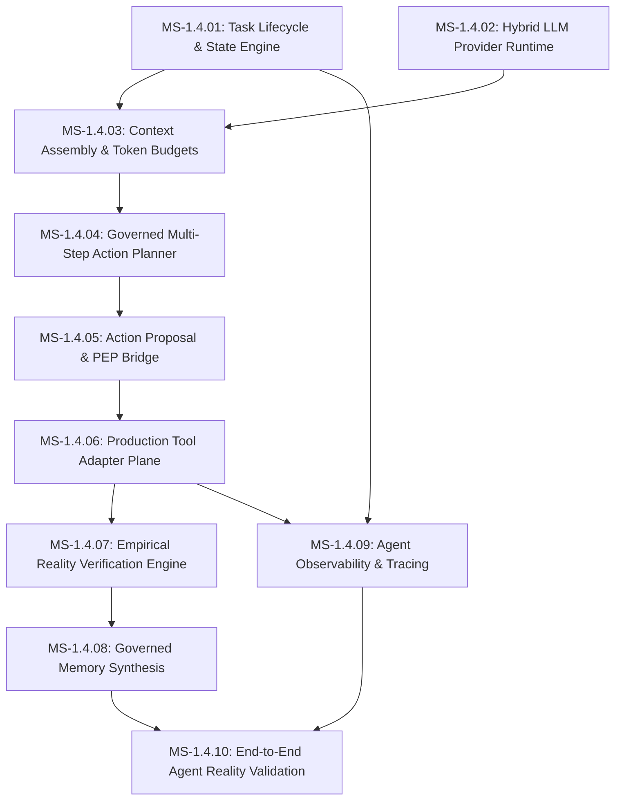

# BOWCON V4 — PHASE 1.4 ARCHITECTURE DEFINITION & ROADMAP RECONCILIATION
## Governed Agent Execution Plane Specification

---

### 1. Executive Summary
Following the completion of **MS-1.3.78** and the delivery of the **Final Human Phase 1.3 Exit Review**, the **BOWCON V4 Governance Plane** stands mathematically proven, fully tenant-isolated, and closed across 24/24 canonical exit criteria (supported by 81 passing regression suites and 3,022 verified assertions). 

However, an authoritative architectural audit reveals that **Phase 1.3 became an enterprise-grade governance superstructure**, absorbing capabilities originally slated for later stages (such as policy evolution, candidate authorization, active PDP/PEP synchronization, rollback boundaries, incident containment, and evidence auditing). 

The primary architectural risk facing BOWCON V4 is **governance recursion**—the temptation to continuously build meta-governance layers rather than the operational agent itself. 

**Phase 1.4 is therefore defined NOT as more governance, but as the construction of the GOVERNED AGENT EXECUTION PLANE** operating strictly underneath and controlled by the proven Phase 1.3 Governance Plane.

```
===================================================================================
PHASE 1.4 ARCHITECTURAL OBJECTIVE:
BUILD THE GOVERNED AGENT EXECUTION PLANE ON TOP OF THE PROVEN PHASE 1.3 GOVERNANCE PLANE
===================================================================================
```

---

### 2. Original Roadmap Reference
The reconciliation is anchored against the canonical foundational specifications of the repository:
1. **Primary Operational Roadmap**: [`docs/BOWCON_L4_ROADMAP.md`](file:///c:/Users/MSI_dualXeon/Desktop/BOW/bow-agent/docs/BOWCON_L4_ROADMAP.md) (Milestones M0 through M9 — Autonomous Agent Within a Defined Operating Domain).
2. **Master Execution Plan**: [`docs/BOWCON_V4_EXECUTION_PLAN.md`](file:///c:/Users/MSI_dualXeon/Desktop/BOW/bow-agent/docs/BOWCON_V4_EXECUTION_PLAN.md) (Milestones A through D — Coordinated Implementation Plan).
3. **Authoritative Architecture Contract**: [`docs/BOWCON_V4_ARCHITECTURE.md`](file:///c:/Users/MSI_dualXeon/Desktop/BOW/bow-agent/docs/BOWCON_V4_ARCHITECTURE.md) (20 canonical sections governing Brain/Body separation, 7-Stage Core Loop, Memory, and Safety).
4. **Authoritative Component Matrix**: [`docs/BOWCON_V4_COMPONENT_MATRIX.md`](file:///c:/Users/MSI_dualXeon/Desktop/BOW/bow-agent/docs/BOWCON_V4_COMPONENT_MATRIX.md) (900 cataloged components; 877 REAL).

---

### 3. Roadmap Reconciliation Matrix

| Original Requirement (L4 Roadmap / Plan) | Current Architecture Status | Current Reality | Phase Destination | Reconciled Decision |
|:---|:---|:---:|:---:|:---|
| **M0: Autonomy Charter & Risk Register** | Fully formalized in `docs/` and enforced in policy engines | **REAL** | Phase 1.1 / 1.3 | **PRESERVED**: Foundational baseline |
| **M1: Gateway & Secret Hardening** | `BowCentralAgentServer`, `RequestGuard`, `WebhookVerifier`, `SecureRemoteGateway` | **REAL** | Phase 1.2 / 1.3.22 | **PRESERVED**: Network edge hardened |
| **M2: Single PDP, Approval & Audit Ledger** | `PolicyDecisionPoint`, `ApprovalService`, `IdempotencyStore`, `AuditLedger` | **REAL** | Phase 1.2 / 1.3.4 | **PRESERVED**: Fully active in production |
| **M3: Remove Unsafe Self-Modification** | Dynamic code disabled by production policy (`DynamicSkillManager`); `IsolatedRunner` | **PARTIAL** | Phase 2.1 | **OBSOLETE**: Self-modification is permanently rejected; skills must be statically verified |
| **M4: Scoped State, Memory & Governance** | `MemoryStore`, `DurableJsonStore`, `UserPartitionResolver`, `BossMemoryHub` | **REAL** | Phase 1.3.1 - 1.3.3 | **PRESERVED**: Tenant-partitioned persistence operational |
| **M5: LLM Resilience & Bounded Planning** | `DecisionContext`, `ActionPlanner`, `PlanningService`, `LocalLlmProvider` | **PARTIAL** | Phase 1.3.9 / 1.4 | **NEEDS_REDESIGN**: Bounded planning exists as data contracts; needs live multi-model execution bridge with cost budgets |
| **M6: Robot & Desktop Safety Boundaries** | `RobotSafetyController`, `DesktopTools`, `DesktopChannelAdapter` | **REAL** | Phase 1.2 / 1.3.12 | **PARTIALLY_IMPLEMENTED**: Governance gates exist; execution adapters require real OS runtime bridge |
| **M7: Evaluation & Golden Sets** | Dedicated reality tests across 81 suites; 3,022 assertions; regression runner | **REAL** | Phase 1.3.78 | **ABSORBED_BY_PHASE_1_3**: Empirical testing established as terminal verification gate |
| **M8: Observability & Production Operations** | `PolicyObservability`, `PolicyIncidentResponse`, `WatchdogDaemon` | **REAL** | Phase 1.3.62 / 1.3.74 | **ABSORBED_BY_PHASE_1_3**: Governance observability complete; Agent task tracing deferred to Phase 1.4 |
| **M9: L4 ODD Validation & Controlled Rollout** | Governed Canary, Staged Activation, Phase Transition boundaries | **REAL** | Phase 1.3.55 / 1.3.70 / 1.3.77 | **ABSORBED_BY_PHASE_1_3**: Transition boundaries fully implemented |

---

### 4. Current Architecture Snapshot

```
+---------------------------------------------------------------------------------------------------+
|                                  CURRENT REPOSITORY ARCHITECTURE                                  |
+---------------------------------------------------------------------------------------------------+
|  [SECURITY PLANE]                                                                                 |
|  - RequestGuard (IP sliding window, origin checks)                                                |
|  - WebhookVerifier (HMAC-SHA256, replay protection)                                               |
|  - UserPartitionResolver (Path traversal, null byte, device name guards)                          |
|  - USER_STOP Controller (Universal execution preemption)                                         |
+---------------------------------------------------------------------------------------------------+
|  [GOVERNANCE PLANE (MS-1.3.62 - MS-1.3.78) — 100% COMPLETE & PROVEN]                                |
|  - Policy Observability (MS-1.3.62) & Evidence Investigation (MS-1.3.63)                           |
|  - Policy Decision (MS-1.3.64), Remediation (MS-1.3.65) & Post-Execution Review (MS-1.3.66)        |
|  - Feedback Review (MS-1.3.67), Evolution Planning (MS-1.3.68) & Candidate Auth (MS-1.3.69)      |
|  - Staged Activation (MS-1.3.70) & Active Runtime Synchronization (MS-1.3.71)                     |
|  - Active Rollback (MS-1.3.72), Lifecycle Reconcile (MS-1.3.73) & Incident Response (MS-1.3.74)   |
|  - Incident Resolution (MS-1.3.75), Readiness Assessment (MS-1.3.76)                              |
|  - Phase Transition Boundary (MS-1.3.77) & Independent Evidence Audit (MS-1.3.78)                |
+---------------------------------------------------------------------------------------------------+
|  [EXISTING AGENT EXECUTION PIECES (MS-1.2, MS-1.3.7 - MS-1.3.15, MS-1.3.35 - MS-1.3.40)]          |
|  - Core Loop Abstraction: AgentLoop (7-stage state machine)                                       |
|  - Reasoning & Intent: IntentService, PlanningService, DecisionService (Isolated data components) |
|  - Execution Bridge: ActionOrchestrator, CapabilityRegistry, ExecutionService                     |
|  - Verification & Commit: VerificationService, DurableCommitService                               |
|  - Working Memory: MemoryStore, ContextManager (Session-scoped memory)                            |
+---------------------------------------------------------------------------------------------------+
|  [WHAT IS MISSING: THE CONNECTED, OPERATIONAL AGENT EXECUTION PLANE]                              |
|  - No unified Task Lifecycle Engine managing multi-step, long-running agent workflows             |
|  - No live Hybrid LLM execution bridge enforcing token/latency/cost budgets                       |
|  - No real desktop/shop tool adapters operating under single-use execution tokens                 |
|  - No dynamic replanning mechanism upon policy denial                                             |
|  - No end-to-end task tracing linking User Input -> Intent -> Plan -> PDP -> Tool -> Memory       |
+---------------------------------------------------------------------------------------------------+
```

---

### 5. What Phase 1.3 Absorbed
The following capabilities, originally envisioned as later operational milestones, were pulled forward and comprehensively completed in Phase 1.3:
1. **Policy Evolution & Candidate Synthesis (MS-1.3.68)**: Bounded generation of candidate rules without self-activation.
2. **Human Candidate Authorization Gate (MS-1.3.69)**: Non-bypassable human role enforcement with anti-self-approval.
3. **Staged Policy Activation & PDP Sync (MS-1.3.70 & MS-1.3.71)**: Multi-stage promotion and synchronized PDP/PEP state distribution.
4. **Active Rollback, Sunset & Recovery (MS-1.3.72)**: Governed state restoration without direct filesystem tampering.
5. **Emergency Containment & Incident Resolution (MS-1.3.74 & MS-1.3.75)**: Automatic safety freeze and human containment clearance.
6. **Governance Readiness Assessment (MS-1.3.76)**: 24-criteria non-authoritative review.
7. **Phase Transition & Entry Boundary (MS-1.3.77)**: Formal decoupled lifecycle for Phase Exit and Phase 1.4 Entry.
8. **Independent Evidence Audit (MS-1.3.78)**: Read-only multi-vector audit with graph cycle detection.

---

### 6. What Remains Missing (The Architectural Gaps)
To evolve from a static governance contract into a functioning Level-4 Agent in its defined operating domain, BOWCON V4 requires the following concrete capabilities:

```
[INPUT] ──> 1. Task Intake & Lifecycle (MISSING)
                ↓
            2. Live Context Assembly & Budgets (PARTIAL)
                ↓
            3. Multi-Step Bounded Planning (PARTIAL)
                ↓
   ┌─────── 4. Governed Action Proposal (PARTIAL)
   │            ↓
[GOVERNANCE] 5. Policy Decision Point (PDP) (EXISTS - Phase 1.3)
   │            ↓
   └──────> 6. Tool Execution Dispatch (PARTIAL - Lacks real adapters)
                ↓
            7. Empirical OS Observation & Verification (PARTIAL)
                ↓
            8. Governed Memory Synthesis (PARTIAL - Lacks reflection loop)
```

1. **Gap 1: Unified Autonomous Task Lifecycle Manager**:
   The system lacks an engine to track long-running, multi-step tasks across states (`SUBMITTED`, `PLANNING`, `AWAITING_APPROVAL`, `EXECUTING`, `VERIFYING`, `SUSPENDED`, `COMPLETED`, `FAILED`).
2. **Gap 2: Real Hybrid Model Provider Runtime**:
   While `LocalLlmProvider` and `GeminiClient` exist, there is no production provider bridge with strict latency/token budgets, circuit breakers, and explicit fallback semantics.
3. **Gap 3: Governed Multi-Step Action Planner & Replanner**:
   Existing planning generates single static candidate steps. The agent cannot decompose a high-level goal into an ordered sequence of governed steps or replan when a step is denied.
4. **Gap 4: Production Tool Adapter Plane**:
   Tool execution is currently verified using mock providers. Real desktop automation (`DesktopTools`) and shop management (`ShopTools`) lack hardened, isolated execution harnesses.
5. **Gap 5: Empirical Reality Verification Engine**:
   Verification currently evaluates static postcondition objects. It needs real OS/file/API inspection probes to verify that side-effects genuinely occurred.
6. **Gap 6: Closed-Loop Memory Synthesis & Reflection**:
   Memory commits occur per turn, but there is no cross-step episodic synthesis that records learned task execution patterns into L4/L5 memory without polluting stores on failure.
7. **Gap 7: Agent Task Observability & Distributed Tracing**:
   OpenTelemetry tracing across the full agent execution lifecycle (correlating task ID, LLM prompt, PDP decision, tool output, and audit hash).

---

### 7. Governance Plane Definition
- **Primary Responsibility**: Uphold safety invariants, evaluate authorization requests, enforce policy constraints, maintain immutable audit ledgers, preserve cryptographic provenance, and execute emergency containment.
- **Authority**:
  - Exclusively owns `PolicyDecisionPoint`, `ApprovalService`, `PolicyActiveRollbackRuntime`, and `PolicyPhaseTransitionRuntime`.
  - Exclusively issues `PERMIT`, `DENY`, and `APPROVAL_REQUIRED` decisions.
  - Exclusively manages emergency containment freezes.
- **Non-Authority**:
  - Possesses **zero authority** to initiate user tasks.
  - Possesses **zero authority** to execute tools directly.
  - Possesses **zero authority** to generate agent reasoning or conversational dialogue.
  - Possesses **zero authority** to self-authorize policy changes or phase transitions.

---

### 8. Agent Execution Plane Definition
- **Primary Responsibility**: Understand user intent, retrieve relevant context, formulate bounded multi-step plans, propose actions to the Governance Plane, dispatch permitted tool calls, observe empirical outcomes, verify postconditions, and report results to the user.
- **Authority**:
  - Exclusively owns task state machines, working context, prompt synthesis, tool dispatching, and plan execution loops.
- **Non-Authority**:
  - Possesses **zero authority** to bypass `PolicyDecisionPoint` (PDP).
  - Possesses **zero authority** to execute tools without PDP clearance or valid execution tokens.
  - Possesses **zero authority** to self-approve `HIGH_IMPACT` actions.
  - Possesses **zero authority** to mutate policy files or governance rules.
  - Possesses **zero authority** to modify or truncate the audit ledger.
  - Possesses **zero authority** to bypass `USER_STOP`.

---

### 9. Cross-Plane Boundary (The Hard Boundary)

```
+-----------------------------------------------------------------------------------+
|                           AGENT EXECUTION PLANE                                   |
|                                                                                   |
|   1. User Task Intake  ──>  2. Planning Engine  ──>  3. Action Proposal           |
+------------------------------------------------------------│----------------------+
                                                             │
                                   [UNTRUSTED PROPOSAL]      │ (Requires Clearance)
                                                             v
+-----------------------------------------------------------------------------------+
|                           GOVERNANCE PLANE (PHASE 1.3)                            |
|                                                                                   |
|   4. PolicyDecisionPoint (PDP)                                                    |
|      ├── PERMIT ------------> Issues One-Time Execution Token                     |
|      ├── APPROVAL_REQUIRED -> Demands Human Operator Signature                    |
|      └── DENY --------------> Returns Deny Reason & Escalates Risk                |
+------------------------------------------------------------│----------------------+
                                                             │
                                   [CLEARED EXECUTION TOKEN] │ (Single-use, Expiring)
                                                             v
+-----------------------------------------------------------------------------------+
|                           TOOL DISPATCH PLANE                                     |
|                                                                                   |
|   5. ToolRegistry / ExecutionGate                                                 |
|      ├── Verifies Token Fingerprint & Expiry                                      |
|      ├── Executes Isolated Tool Adapter                                           |
|      └── Records Outcome to Immutable Audit Ledger                                |
+------------------------------------------------------------│----------------------+
                                                             │
                                   [RAW TOOL OUTPUT]         │
                                                             v
+-----------------------------------------------------------------------------------+
|                           VERIFICATION & COMMIT                                   |
|                                                                                   |
|   6. Reality Verification  ──>  7. Governed Memory Commit (Only on Proven Success)|
+-----------------------------------------------------------------------------------+
```

#### Non-Bypassable Enforcement Rules:
1. `ToolRegistry.executeTool()` verifies that `PolicyDecisionPoint.evaluate()` was called and returned `PERMIT` (or valid single-use human approval token).
2. Direct calls to OS primitives, child processes, or filesystem writes outside governed adapters are strictly prohibited.
3. Every step in the execution pipeline checks `isUserStopActive()`. If active, execution terminates synchronously.

---

### 10. Phase 1.4 Architectural Objective
```text
====================================================================================
PHASE 1.4 = 
BUILD THE GOVERNED AGENT EXECUTION PLANE
ON TOP OF THE PROVEN PHASE 1.3 GOVERNANCE PLANE
====================================================================================
```
Phase 1.4 transitions BOWCON V4 from a hardened, verified governance specification into an **active, operational Level-4 Agent runtime within its bounded domain (Shop of BOW & Desktop Operations)** without compromising any security invariant.

---

### 11. Proposed Phase 1.4 Milestones
The following 10 milestones form a strictly bounded, non-overlapping architectural roadmap for Phase 1.4:

| Milestone ID | Milestone Name | Architectural Responsibility | Primary Deliverables |
|:---|:---|:---|:---|
| **MS-1.4.01** | **Agent Task Lifecycle & State Engine** | Manages multi-step task progression, pause/resume, persistence, and state transitions | `TaskLifecycleEngine`, `TaskStateStore`, `TaskQueueManager` |
| **MS-1.4.02** | **Hybrid LLM Cognitive Provider Runtime** | Real inference integration (Gemini + local Ollama) with strict token, latency, and cost budgets | `CognitiveProviderRuntime`, `ModelCircuitBreaker`, `FallbackInferenceEngine` |
| **MS-1.4.03** | **Context Assembly & Dynamic Compaction** | Assembles multi-source context (user, session, memory, system instructions) under token bounds | `ContextAssemblyEngine`, `TokenBudgetManager`, `DynamicCompactionService` |
| **MS-1.4.04** | **Governed Multi-Step Action Planner** | Decomposes tasks into ordered sub-goals and candidate action plans with explicit dependencies | `MultiStepActionPlanner`, `PlanDependencyGraph`, `ReplanningEngine` |
| **MS-1.4.05** | **Governed Action Proposal & PEP Bridge** | Binds candidate plans to Phase 1.3 PDP/PEP; manages approval requests and denial handling | `ActionProposalBoundary`, `PepExecutionBridge`, `ApprovalDemandEmitter` |
| **MS-1.4.06** | **Production Tool Adapter Plane (Desktop & Shop)** | Hardened, isolated adapters for real desktop operations and shop API calls under single-use tokens | `ProductionToolHarness`, `DesktopActionAdapter`, `ShopActionAdapter` |
| **MS-1.4.07** | **Empirical Reality Verification Engine** | Active postcondition verification via OS state inspection, filesystem checks, and API validation | `RealityVerificationProbe`, `StateInspectionEngine`, `VerificationOracle` |
| **MS-1.4.08** | **Governed Episodic Memory Synthesis** | Closed-loop memory reflection; updates L3 knowledge and L4/L5 memory strictly upon verified success | `EpisodicMemorySynthesizer`, `ReflectionEngine`, `MemoryCommitGuard` |
| **MS-1.4.09** | **Agent Observability & Tracing Infrastructure**| Distributed OpenTelemetry tracing linking User Request -> LLM -> Plan -> PDP -> Tool -> Audit | `AgentTraceCollector`, `TaskTelemetryEmitter`, `ExecutionSloTracker` |
| **MS-1.4.10** | **End-to-End Agent Reality Validation** | Holistic reality testing of autonomous task execution in shop and desktop domains under chaos & faults | `EndToEndAgentRealitySuite`, `ChaosFaultInjectionTest`, `Phase14ReadinessAudit` |

---

### 12. Dependency Graph


---

### 13. Phase 1.4 Exit Criteria (Measurable & Evidence-Based)
Before Phase 1.4 can be declared ready for human exit review, the following empirical criteria must be proven:

1. **`CRIT-1.4-01: Multi-Step Task Completion`**: Autonomous completion of multi-step tasks across >= 3 sequential tools with verified intermediate states.
2. **`CRIT-1.4-02: Zero Tool Execution Without PDP Clearance`**: 100% of tool dispatches verify valid PDP PERMIT decision or single-use human approval token.
3. **`CRIT-1.4-03: Zero Unhandled Denials (Safe Replanning)`**: When PDP denies an action step, agent safely halts or replans; zero infinite retry loops.
4. **`CRIT-1.4-04: Enforced Inference Budgets`**: Hard token limits, timeout caps (<= 30s), and cost caps strictly enforced across all LLM inference calls.
5. **`CRIT-1.4-05: Real Tool Execution Isolation`**: Desktop and Shop tool adapters operate in isolated execution contexts with zero leakage of host environment secrets.
6. **`CRIT-1.4-06: Empirical Postcondition Verification`**: Execution success confirmed by active OS state / file / API probes (not LLM self-declaration).
7. **`CRIT-1.4-07: Memory Pollution Invariant`**: Zero episodic or durable memory updates occur when a task fails or verification fails.
8. **`CRIT-1.4-08: Complete Distributed Traces`**: 100% of executed tasks emit end-to-end trace spans linking User Query -> LLM -> Plan -> PDP -> Tool -> Audit.
9. **`CRIT-1.4-09: USER_STOP Preemption Latency`**: Instant synchronous abort of in-flight tasks upon `isUserStopActive()` signal (<= 100ms).
10. **`CRIT-1.4-10: Multi-Tenant Task Isolation`**: Zero data leakage between simultaneous tasks of different tenants under adversarial concurrent load.
11. **`CRIT-1.4-11: Full Regression Integrity`**: 100% pass rate maintained across all legacy regression suites (81+ suites).
12. **`CRIT-1.4-12: Protected Workspace Untouched`**: `C:\BOW\shopofbow` verified untouched throughout all Phase 1.4 execution.

---

### 14. Security Invariants (Carried Forward from Phase 1.3)
The non-negotiable security foundation established in Phase 1.3 remains active and binding:
```text
HUMAN_AUTHORIZATION > AUTONOMOUS_AUTHORIZATION
USER_STOP > EVERYTHING
READINESS != AUTHORIZATION
AUTHORIZATION != COMMIT
ZERO_AUTONOMOUS_POLICY_MUTATION
ZERO_DIRECT_TOOL_EXECUTION
FAIL_CLOSED_POSTURE
APPEND_ONLY_AUDIT_TRAILS
CRYPTOGRAPHIC_PROVENANCE_CHAINS
PROTECTED_WORKSPACE_UNTOUCHED (C:\BOW\shopofbow)
```

---

### 15. Over-Engineering Assessment
1. **Component Inflation Check**: The 10 proposed milestones consolidate capabilities into coherent, bounded modules. They avoid micro-components that merely wrap single functions.
2. **Duplicate Boundary Check**: No new policy evaluation or authorization boundaries are created. All agent proposals route strictly to the existing Phase 1.3 PDP/PEP.
3. **Governance Recursion Check**: Phase 1.4 contains **zero** new policy governance layers, zero meta-audit layers, and zero policy evolution redesigns.
4. **Fake Reality Risk Check**: Phase 1.4 requires real OS adapters (PowerShell screen capture, Windows Credential Manager, filesystem probes) rather than synthetic mock classes.
5. **Authority Confusion Check**: The Agent Execution Plane is explicitly subordinate to the Governance Plane. It has zero policy mutation methods.

---

### 16. Architecture Decision
```text
====================================================================================
ARCHITECTURE DECISION:
APPROVED_FOR_PHASE_1_4_ARCHITECTURE_DEFINITION
====================================================================================
```
The architecture definition for Phase 1.4 is logically complete, evidence-grounded, and decoupled from implementation. It provides the necessary blueprint for autonomous Level-4 execution under strict governance.

---

### 17. Human Decision Required
Before any implementation of **MS-1.4.01** may begin, the following explicit human operator decisions are required:
1. **Human Phase 1.3 Exit Authorization**: Provide formal authorization through `PolicyPhaseExitAuthorizationBoundary` (granting `PhaseExitAuthorizationId`).
2. **Human Phase 1.4 Entry Authorization**: Provide separate formal authorization through `PolicyPhase14EntryAuthorizationBoundary` (granting `Phase14EntryAuthorizationId`).
3. **Formal Approval of Phase 1.4 Architecture Roadmap**: Human sign-off on the 10 proposed Phase 1.4 milestones and exit criteria documented herein.
