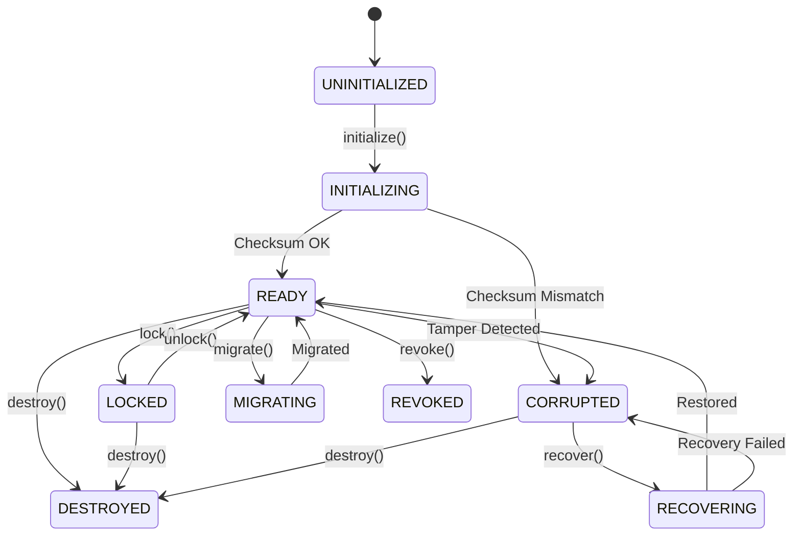

# BOWCON V4.0 — SECURE DEVICE CREDENTIAL VAULT & DURABLE TRUST PERSISTENCE RUNTIME
## Mô Hình Kho Lưu Trữ Thông Tin Xác Thực Thiết Bị An Toàn & Duy Trì Độ Tin Cậy Bền Vững (Song Ngữ Anh - Việt / Bilingual EN-VI)
### Milestone MS-1.3.25 Architectural Specification

---

## 1. EXECUTIVE ARCHITECTURE SUMMARY / TÓM TẮT KIẾN TRÚC ĐIỀU HÀNH

### English
The **Secure Device Credential Vault & Durable Trust Persistence Runtime** (`DeviceVaultRuntime`) establishes the foundational cryptographic persistence layer for BOWCON V4.0. It guarantees that device identity, public keys, cryptographic trust status, and credential rotation state survive application reboots, unexpected host crashes, and cold starts without requiring password entry, OAuth handshakes, or cloud IdP connections.

The architecture is built upon a fail-closed, defense-in-depth model where:
1. All persisted envelopes are cryptographically checksummed and tamper-evident.
2. Writes are atomic via `.tmp` temporary files, OS flush synchronizations, and `.marker` crash files.
3. Private key material is never held, written, or returned—only opaque references (`ref://vault/...`) are stored.
4. Schema migrations (v1 -> v2) are executed in memory and validated prior to durable replacement.
5. All credentials are partitioned by an authoritative 9-tuple scope preventing cross-user, cross-device, cross-session, or cross-surface leakage.

### Tiếng Việt
**Kho Lưu Trữ Thông Tin Xác Thực Thiết Bị An Toàn & Runtime Duy Trì Độ Tin Cậy Bền Vững** (`DeviceVaultRuntime`) thiết lập tầng lưu trữ mật mã nền tảng cho BOWCON V4.0. Module này đảm bảo danh tính thiết bị, khóa công khai, trạng thái tin cậy mật mã và trạng thái luân chuyển khóa tồn tại bền vững qua các lần khởi động lại ứng dụng, sự cố máy chủ đột ngột và khởi động nguội mà không yêu cầu mật khẩu, xác thực OAuth hay bất kỳ nhà cung cấp danh tính đám mây (cloud IdP) nào.

Kiến trúc được xây dựng trên mô hình phòng vệ chiều sâu, đóng-khi-lỗi (fail-closed):
1. Mọi phong bì lưu trữ (envelope) đều được gắn mã kiểm tra toàn vẹn (checksum) và phát hiện can thiệp.
2. Thao tác ghi đạt tính nguyên tử (atomic) nhờ file tạm `.tmp`, đồng bộ hóa hệ điều hành và file đánh dấu `.marker`.
3. Khóa riêng tư (private key) tuyệt đối không bao giờ được nắm giữ, ghi đĩa hay trả về—chỉ lưu trữ tham chiếu mờ (`ref://vault/...`).
4. Nâng cấp phiên bản lược đồ (v1 -> v2) diễn ra an toàn trên bộ nhớ và được kiểm định toàn vẹn trước khi ghi đè bền vững.
5. Mọi thông tin xác thực được cô lập nghiêm ngặt theo bộ 9 thuộc tính (9-tuple scope) ngăn chặn rò rỉ chéo người dùng, thiết bị, phiên làm việc hoặc bề mặt.

---

## 2. INVARIANT BOUNDARIES & AUTHORITY SEPARATION / RANH GIỚI BẤT BIẾN & TÁCH BIỆT QUYỀN HẠN

### Core Architectural Invariants / Các Bất Biến Cốt Lõi:
```text
PERSISTENCE           ≠  BRAIN_MEMORY
PERSISTENCE           ≠  AUTHORIZATION
PERSISTENCE           ≠  EXECUTION_AUTHORITY
PERSISTENCE           ≠  BRAIN_AUTHORITY
DEVICE_KEY            ≠  BRAIN_KEY
DEVICE_IDENTITY       ≠  USER_IDENTITY
DEVICE_IDENTITY       ≠  SESSION_ID
DEVICE_TRUST          ≠  EXECUTION_AUTHORITY
```

### English
- **Persistence is NOT Brain Memory**: Storing a credential record in the vault does not modify, corrupt, or simulate Brain cognitive memory. The vault is an operational substrate, not an authorization policy engine.
- **Persistence is NOT Authorization**: Having a valid stored credential proves that a device was previously enrolled; it grants zero ambient permissions to execute tools, dispatch orders, or bypass approval policies.
- **Persistence is NOT Execution Authority**: Storing or loading a credential cannot actuate robots, manipulate DOMs, or launch OS shell commands.
- **Device Key is NOT Brain Key**: Device keys are generated and held on edge client surfaces. Brain authority keys are strictly isolated within the Brain trust root.
- **Device Identity is NOT User Identity**: A device represents hardware/client context. A user represents an authenticated person or principal. A user may own multiple devices, and a shared device cannot impersonate a user.

### Tiếng Việt
- **Lưu trữ bền vững KHÔNG PHẢI Bộ nhớ Brain**: Lưu trữ bản ghi xác thực trong vault không làm thay đổi hay giả lập bộ nhớ nhận thức của Brain. Vault chỉ là hạ tầng vận hành, không phải engine chính sách ủy quyền.
- **Lưu trữ bền vững KHÔNG PHẢI Ủy quyền (Authorization)**: Sở hữu một bản ghi xác thực hợp lệ chỉ chứng minh thiết bị đã được ghi danh trước đó; nó không cấp quyền tự động để thực thi công cụ hay bỏ qua chính sách phê duyệt.
- **Lưu trữ bền vững KHÔNG PHẢI Quyền thực thi**: Thao tác đọc/ghi vault không thể điều khiển robot, giao diện web hay gọi lệnh OS shell.
- **Khóa thiết bị KHÔNG PHẢI Khóa Brain**: Khóa thiết bị nằm tại client/edge surface. Khóa thẩm quyền Brain nằm tách biệt hoàn toàn trong gốc tin cậy của Brain.
- **Danh tính thiết bị KHÔNG PHẢI Danh tính người dùng**: Thiết bị đại diện cho phần cứng. Người dùng đại diện cho chủ thể xác thực. Một người dùng có thể có nhiều thiết bị, và thiết bị không thể mạo danh người dùng.

---

## 3. VAULT STATE TAXONOMY & PREDICATES / PHÂN LOẠI TRẠNG THÁI VAULT & VỊ TỪ KIỂM TRA

### 10 Canonical States:
| State | Type | Description (EN) | Mô tả (VI) |
|---|---|---|---|
| `UNINITIALIZED` | Initial | Instantiated, not yet verified | Khởi tạo ban đầu, chưa tải dữ liệu |
| `INITIALIZING` | Transient | Scanning and verifying envelopes | Đang quét và kiểm định toàn vẹn |
| `READY` | Operational | Healthy and accepting operations | Sẵn sàng tiếp nhận thao tác lưu trữ |
| `LOCKED` | Inactive | Administratively locked | Bị khóa quản trị, từ chối mọi thao tác |
| `DEGRADED` | Unhealthy | Partial storage or non-fatal issue | Xuống cấp một phần, kiểm tra thận trọng |
| `CORRUPTED` | Unhealthy | Tamper detected or checksum failure | Phát hiện can thiệp/hỏng dữ liệu, fail-closed |
| `RECOVERING` | Transient | Crash recovery / repair underway | Đang khôi phục từ file tạm/marker |
| `MIGRATING` | Transient | Schema version upgrade underway | Đang di chuyển lược đồ dữ liệu |
| `REVOKED` | Terminal | Vault or device permanently revoked | Bị thu hồi vĩnh viễn, không thể phục hồi |
| `DESTROYED` | Terminal | Explicitly shut down and cleaned up | Đã giải phóng tài nguyên, hủy hoàn toàn |

---

## 4. FINITE-STATE TRANSITION MATRIX / MA TRẬN CHUYỂN TRẠNG THÁI HỮU HẠN

### Transition Table:


---

## 5. DETERMINISTIC VAULT IDENTITY GENERATION / TẠO DANH TÍNH VAULT XÁC ĐỊNH

All identifiers follow canonical naming formats generated via deterministic FNV-1a 32-bit hashing:
- **Vault ID**: `vault_<8-hex>` (e.g., `vault_12345678`)
- **Entry ID**: `entry_<8-hex>` (derived deterministically from `deviceId:keyId:keyVersion`)
- **Record ID**: `vrecord_<8-hex>` (derived deterministically from `deviceId:scopeString`)
- **Audit ID**: `vaudit_<8-hex>` (derived deterministically from event index and metadata)

---

## 6. DETERMINISTIC DIGEST & FINGERPRINTING / HÀM BĂM XÁC ĐỊNH & DẤU VÂN TAY TOÀN VẸN

### Canonical Order-Independent Stringification:
Objects are recursively normalized:
1. Object keys are lexicographically sorted.
2. `undefined` fields are filtered out to ensure identical serialized byte sequences before and after JSON re-parsing.
3. Arrays maintain sequence with elements recursively canonicalized.
4. Digested using 32-bit FNV-1a into an 8-character lowercase hexadecimal string.
5. In-memory data structures are frozen using `deepFreezeVault()` to prevent post-verification tampering.

---

## 7. OPAQUE `privateKeyRef` ABSTRACTION / THAM CHIẾU MỜ `privateKeyRef` & CHỐNG LỘ KHÓA

### Strict Zero-Leakage Guarantee:
```text
Canonical Format: ref://vault/<vaultId>/<entryId>
```
- **Scanner Detection**: Every object, error, audit log, and file write passes through `containsRawPrivateKey()` and `assertNoRawPrivateKey()`.
- **Patterns Blocked**:
  - PEM headers (`BEGIN PRIVATE KEY`, `BEGIN RSA PRIVATE KEY`, `BEGIN EC PRIVATE KEY`).
  - JWK private parameters (`kty: OKP`, `kty: RSA`, `d: <scalar_bytes>`).
  - Sensitive object keys (`privateKey`, `privateKeyBytes`, `privateKeyPem`, `privateKeyBase64`, `privateKeyDer`).

---

## 8. ATOMIC WRITE ENGINE & CRASH RESILIENCE / ĐỘNG CƠ GHI NGUYÊN TỬ & PHỤC HỒI SỰ CỐ

### Atomic Write Protocol:
1. **Payload Staging**: Write data to temporary file `<dest>.tmp.<checksum>`.
2. **Crash Marker Creation**: Write `<dest>.marker` containing JSON payload `{ targetPath, tmpPath, checksum, timestamp }`.
3. **Atomic Replace**: Execute atomic rename (`fs.renameSync`) replacing destination file.
4. **Marker Cleanup**: Unlink `<dest>.marker`.

### Recovery Protocol (`recoverInterruptedWriteSync`):
- If destination is missing and marker exists:
  - Verify temporary file checksum against marker checksum.
  - If valid: complete rename operation to destination.
  - If invalid: delete corrupted temporary file and discard marker (fail-closed).
- If destination exists: prior intact state remains authoritative.

---

## 9. 9-TUPLE SCOPE ISOLATION / CÔ LẬP PHẠM VI 9 THUỘC TÍNH

Every credential operation is strictly scoped to the 9-tuple identity:
```typescript
interface ScopedDeviceIdentity {
  userId: string;
  sessionId: string;
  deviceId: string;
  surfaceId: string;
  brainId: string;
  transportId: string;
  gatewayId: string;
  adapterId: string;
  connectionId: string;
}
```
- **Cross-User Rejection**: A credential enrolled under `usr_alice` cannot be read or matched by `usr_bob`.
- **Cross-Device Rejection**: Querying a nonexistent or mismatched `deviceId` fails with `VAULT_ENTRY_NOT_FOUND`.
- **Cross-Session Rejection**: Scope mismatch triggers immediate `VAULT_SCOPE_MISMATCH`.
- **Cross-Surface Isolation**: Desktop, Mobile, and Robot surfaces maintain independent credential lifecycles.

---

## 10. KEY ROTATION & DURABLE REVOCATION / LUÂN CHUYỂN KHÓA & THU HỒI BỀN VỮNG

### Key Rotation:
- Increments `activeKeyVersion` (e.g., 1 -> 2).
- Stored previous entry status is transitioned from `ACTIVE` to `ROTATED`.
- New entry is marked `ACTIVE` with updated opaque `privateKeyRef`.
- Checksums and envelopes are recalculated atomically.

### Durable Revocation:
- Sets `revoked: true`, captures `revocationReason`, and marks all entries as `REVOKED`.
- Survives application shutdown, restart, and cache purge.
- Post-revocation load attempts fail closed immediately with `VAULT_DEVICE_REVOKED`.

---

## 11. AUDIT LEDGER & AUTOMATED SECRET SCRUBBING / NHẬT KÝ KIỂM TOÁN & LÀM SẠCH BÍ MẬT

- **Append-Only Immutability**: All records are deeply frozen upon insertion into `DeviceVaultAuditLedger`.
- **14 Authoritative Event Types**: `VAULT_INITIALIZED`, `VAULT_LOCKED`, `VAULT_UNLOCKED`, `VAULT_ENTRY_SAVED`, `VAULT_ENTRY_LOADED`, `VAULT_ENTRY_DELETED`, `VAULT_INTEGRITY_CHECKED`, `VAULT_INTEGRITY_FAILED`, `VAULT_RECOVERED`, `VAULT_MIGRATED`, `VAULT_KEY_ROTATED`, `VAULT_DEVICE_REVOKED`, `VAULT_TRANSACTION_COMMITTED`, `VAULT_TRANSACTION_ABORTED`.
- **Automated Scrubbing**: `scrubVaultSecrets` recursively sanitizes object trees, replacing passwords, tokens, credentials, and private key representations with `[REDACTED_VAULT_SECRET]`.

---

## 12. AGENTLOOP OBSERVATIONAL INTEGRATION / TÍCH HỢP QUAN SÁT VỚI AGENTLOOP

- `AgentLoop` instantiates and manages an isolated `DeviceVaultRuntime`.
- Public getter: `loop.getDeviceVaultRuntime()`.
- Observational context: `AgentLoopResult.deviceVaultContext` reports current vault state, registered devices count, and vault identity without exposing secrets or authorizing actions.

---

## 13. COMPILATION & VERIFICATION EVIDENCE / BẰNG CHỨNG BIÊN DỊCH & KIỂM THỬ

1. **Dedicated Test Suite** (`tests/test_v4_agent_secure_device_vault.ts`):
   - Total Passing Assertions: **235 assertions** (requirement: ≥ 220).
   - Total Categories: **46 categories (A through AT)**.
   - Failures: **0**.
2. **Full Regression Test Suite** (27 Test Suites):
   - Total Executed Suites: **27**.
   - Total Passed Assertions: **2,191 assertions**.
   - Total Failed Suites: **0**.
3. **TypeScript Diagnostics**:
   - `npm run typecheck`: **0 errors**.
4. **Build Bundle**:
   - `npm run build`: **Exit Code 0**; compiled into `dist/`.
5. **Git Whitespace Audit**:
   - `git diff --check`: **0 whitespace errors**.
6. **Protected Workspace Invariant**:
   - `C:\BOW\shopofbow`: **STRICTLY FROZEN (0 touches, 0 reads, 0 writes)**.
7. **Package Version Invariant**:
   - `@bow/agent`: **STRICTLY LOCKED at 4.0.0**.
