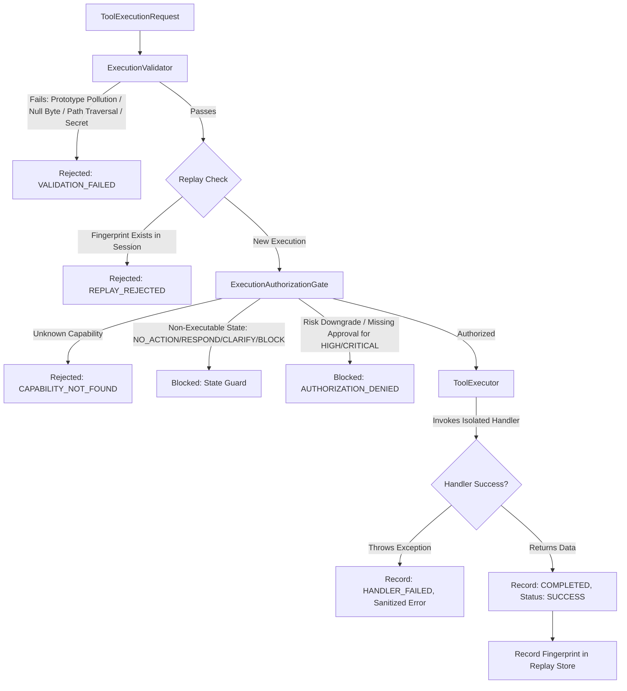

# BOWCON V4.0 — GOVERNED TOOL EXECUTION RUNTIME & SAFE CAPABILITY REGISTRY
# KIẾN TRÚC RUNTIME THỰC THI CÔNG CỤ CÓ QUẢN TRỊ & CAPABILITY REGISTRY AN TOÀN

**Document ID:** `BOWCON-V4-DOC-EXEC-1.3.12`  
**Milestone:** `MS-1.3.12`  
**Package:** `@bow/agent` (Version `4.0.0` STRICTLY LOCKED)  
**Security Governance:** ISO/IEC 42001, PDP Level 4 Autonomous Governance  
**Languages:** English & Tiếng Việt (Bilingual Developer Reference)

---

## 1. ARCHITECTURE OVERVIEW / TỔNG QUAN KIẾN TRÚC

### English
The Governed Tool Execution Runtime (`src/core/execution/`) represents Stage 6 of the authoritative BOWCON V4.0 AgentLoop. Prior milestones established the reasoning pipeline:
1. MS-1.3.8: Semantic Intent Understanding (`SemanticIntent`)
2. MS-1.3.9: Context-Aware Planning (`ContextAwarePlan`)
3. MS-1.3.10: Decision Reasoning & Action Selection (`DecisionResult`)
4. MS-1.3.11: Action Orchestration Bridge (`ExecutionRequest`)

MS-1.3.12 implements the first controlled, governed execution layer. It converts an `ExecutionRequest` into an authorized capability execution under strict invariant protections:
- **Allowlisted Capability Registry (`CapabilityRegistry`):** Zero dynamic code discovery, zero runtime `eval`, zero filesystem imports. Every capability must be explicitly registered and frozen.
- **Authoritative Authorization Gate (`ExecutionAuthorizationGate`):** Enforces PDP boundaries, prevents risk downgrade, validates caller identity and session, and enforces explicit approval tokens for `HIGH` and `CRITICAL` risk capabilities.
- **Deterministic Replay & Idempotency Guard:** Caches executed fingerprints strictly scoped to `${userId}::${sessionId}::${executionFingerprint}`. Replay attempts are immediately rejected fail-closed.
- **Failure Isolation (`ToolExecutor`):** Capability errors and exceptions are caught, sanitized against credential leakage, and returned as structured immutable records without crashing the agent loop.
- **Pure Software Intelligence:** Strictly decoupled from any hardware, robotics, servos, cameras, or external network requests.

### Tiếng Việt
Runtime Thực thi Công cụ có Quản trị (`src/core/execution/`) đại diện cho Giai đoạn 6 (Stage 6) của AgentLoop có thẩm quyền trong BOWCON V4.0. Các milestone trước đã thiết lập chuỗi suy luận:
1. MS-1.3.8: Thấu hiểu ý định ngữ nghĩa (`SemanticIntent`)
2. MS-1.3.9: Lập kế hoạch theo ngữ cảnh (`ContextAwarePlan`)
3. MS-1.3.10: Suy luận quyết định & Lựa chọn hành động (`DecisionResult`)
4. MS-1.3.11: Cầu nối điều phối hành động (`ExecutionRequest`)

MS-1.3.12 thiết lập tầng thực thi có kiểm soát và quản trị đầu tiên. Tầng này chuyển hóa `ExecutionRequest` thành một lượt thực thi capability được ủy quyền dưới các quy tắc bất biến nghiêm ngặt:
- **Registry Năng lực Allowlist (`CapabilityRegistry`):** Không quét code động, không `eval` runtime, không import tệp tùy ý. Mọi capability phải được đăng ký và đóng băng (freeze) tường minh.
- **Cổng Ủy quyền Có Thẩm quyền (`ExecutionAuthorizationGate`):** Thực thi ranh giới PDP, ngăn chặn hạ cấp rủi ro, xác thực danh tính người dùng và session, đồng thời đòi hỏi token phê duyệt tường minh cho rủi ro `HIGH` và `CRITICAL`.
- **Phòng thủ Replay & Idempotency Tất định:** Lưu trữ cache fingerprint đã thực thi được phân vùng nghiêm ngặt theo `${userId}::${sessionId}::${executionFingerprint}`. Mọi nỗ lực replay đều bị từ chối dứt khoát theo cơ chế fail-closed.
- **Cô lập Lỗi (`ToolExecutor`):** Mọi lỗi và ngoại lệ phát sinh từ capability đều được bắt giữ an toàn, khử trùng chống rò rỉ thông tin đăng nhập và trả về bản ghi bất biến có cấu trúc mà không làm sập agent loop.
- **Trí tuệ Phần mềm Thuần túy:** Hoàn toàn tách biệt khỏi phần cứng robot, servo, camera hoặc các kết nối mạng tùy ý.

---

## 2. THE 6-STAGE EXECUTION PIPELINE / VÒNG ĐỜI THỰC THI 6 BƯỚC



### English
1. **Validation Stage:** `ExecutionValidator` evaluates input against prototype pollution (`__proto__`, `constructor`, `prototype`), null bytes (`\0`), path traversal (`..`, `/`, `\`), Windows reserved device names (`CON`, `PRN`, `AUX`, `COM1-9`, `LPT1-9`), and unauthenticated actor scopes.
2. **Replay Defense Stage:** Checks whether `${actor.userId}::${actor.sessionId}::${executionFingerprint}` was previously executed. Re-executions trigger `REPLAY_REJECTED`.
3. **Registry Resolution Stage:** Verifies capability presence in the explicitly populated `CapabilityRegistry`.
4. **Authorization Gate Stage:** Verifies PDP governance metadata, checks non-executable state guards (`NO_ACTION`, `RESPOND`, `CLARIFY`, `DEFER`, `BLOCK`), verifies parameter schema contracts, and inspects single-use approval tokens for `HIGH` and `CRITICAL` risk tiers.
5. **Controlled Execution Stage:** `ToolExecutor` executes the synchronous or asynchronous capability handler within a `try / catch` boundary.
6. **Audit & Secret Scrubbing Stage:** Outputs and errors are sanitized via `redactSecrets`, packaged into a frozen `GovernedToolExecutionResult`, and the fingerprint is durably committed to the replay protection set.

### Tiếng Việt
1. **Giai đoạn Xác thực (Validation):** `ExecutionValidator` kiểm tra dữ liệu đầu vào chống ô nhiễm prototype (`__proto__`, `constructor`, `prototype`), ký tự null byte (`\0`), duyệt cây thư mục (`..`, `/`, `\`), tên thiết bị dành riêng của Windows (`CON`, `PRN`, `AUX`, `COM1-9`, `LPT1-9`) và các scope không hợp lệ.
2. **Giai đoạn Phòng thủ Replay:** Kiểm tra xem `${actor.userId}::${actor.sessionId}::${executionFingerprint}` đã từng được thực thi hay chưa. Nếu đã chạy, trả về ngay `REPLAY_REJECTED`.
3. **Giai đoạn Tra cứu Registry:** Xác minh sự tồn tại của capability trong `CapabilityRegistry` allowlist.
4. **Giai đoạn Cổng Ủy quyền:** Xác thực metadata quản trị PDP, kiểm tra trạng thái cấm thực thi (`NO_ACTION`, `RESPOND`, `CLARIFY`, `DEFER`, `BLOCK`), xác thực schema tham số và kiểm tra token phê duyệt một lần cho các cấp độ rủi ro `HIGH` và `CRITICAL`.
5. **Giai đoạn Thực thi Có Kiểm soát:** `ToolExecutor` chạy handler của capability bên trong khối bảo vệ `try / catch`.
6. **Giai đoạn Kiểm toán & Khử trùng:** Dữ liệu đầu ra và lỗi được khử trùng qua `redactSecrets`, đóng gói vào `GovernedToolExecutionResult` bất biến và lưu fingerprint vào tập phòng thủ replay.

---

## 3. CAPABILITY REGISTRY CONTRACTS / HỢP ĐỒNG CAPABILITY REGISTRY

### English
A capability is an authoritative, immutable contract defining a discrete agent skill:

```typescript
export interface ToolCapability {
  readonly name: string;
  readonly description: string;
  readonly domain: CapabilityDomain; // 'orders' | 'catalog' | 'payments' | 'voice' | 'storage' | 'system' | 'mock'
  readonly risk: CapabilityRisk;     // 'LOW' | 'MEDIUM' | 'HIGH' | 'CRITICAL'
  readonly parameters: readonly CapabilityParameter[];
  readonly handler: (args: Readonly<Record<string, unknown>>, context?: unknown) => Promise<unknown> | unknown;
}
```

Key invariants:
- **Immutability:** Registered capabilities are deeply frozen using `Object.freeze()`.
- **Parameter Validation:** Parameter types (`string`, `number`, `boolean`, `object`, `array`) and required flags are enforced prior to handler dispatch.
- **Domain Scoping:** Capabilities are strictly partitioned into functional domains, preventing unauthorized cross-domain escalations.

### Tiếng Việt
Một capability là một hợp đồng bất biến có thẩm quyền định nghĩa một kỹ năng độc lập của agent:
- **Bất biến (Immutability):** Các capability sau khi đăng ký sẽ được đóng băng sâu bằng `Object.freeze()`.
- **Xác thực Tham số:** Kiểu dữ liệu (`string`, `number`, `boolean`, `object`, `array`) và cờ bắt buộc (`required`) được thực thi nghiêm ngặt trước khi gọi handler.
- **Phân vùng Domain:** Các capability được phân định ranh giới chức năng rõ ràng, ngăn ngừa hành vi leo thang đặc quyền chéo domain.

---

## 4. MULTI-TENANT ISOLATION & REPLAY DEFENSE / BẢO VỆ REPLAY & CÔ LẬP ĐA NGƯỜI DÙNG

### English
Replay attacks and accidental duplicate execution are defended against at the session partition level:
```typescript
const replayKey = `${actor.userId}::${actor.sessionId}::${request.executionFingerprint}`;
```
- **Cross-User Independence:** If User A and User B execute identical deterministic fingerprints, User A's execution does **not** block User B.
- **Cross-Session Independence:** Different sessions for the same user do not collide.
- **Session Idempotency:** Within the same session, re-executing the same fingerprint triggers `REPLAY_REJECTED` fail-closed.

### Tiếng Việt
Các cuộc tấn công lặp lại (replay attacks) và việc thực thi trùng lặp ngoài ý muốn được ngăn chặn ở cấp độ phân vùng session:
- **Độc lập Giữa Các Người Dùng:** Nếu Người dùng A và Người dùng B thực thi cùng một fingerprint tất định, việc thực thi của A **không** làm chặn lượt chạy của B.
- **Độc lập Giữa Các Phiên (Session):** Các session khác nhau của cùng một người dùng không bị xung đột.
- **Idempotency Trong Phiên:** Trong cùng một session, việc thực thi lại cùng một fingerprint sẽ bị từ chối dứt khoát với trạng thái `REPLAY_REJECTED`.

---

## 5. SECRET SANITIZATION & FAILURE ISOLATION / KHỬ TRÙNG BÍ MẬT & CÔ LẬP SỰ CỐ

### English
- **Secret Redaction:** Any string containing Bearer tokens, API keys (`sk-...`, `api_key=...`), passwords (`pwd=...`, `password=...`), or private keys is sanitized using regex replacement: `[REDACTED_SECRET]`.
- **Failure Containment:** If a tool handler throws an unhandled error, the runtime:
  1. Catches the exception immediately.
  2. Scrubs any secret traces from `err.message`.
  3. Records status `FAILED` and outcome `HANDLER_FAILED`.
  4. Returns a valid `GovernedToolExecutionResult` without propagating the exception to `AgentLoop`.

### Tiếng Việt
- **Khử trùng Bí mật:** Bất kỳ chuỗi văn bản nào chứa Bearer token, API key (`sk-...`, `api_key=...`), mật khẩu (`pwd=...`, `password=...`), hoặc khóa riêng tư đều được tự động thay thế bằng `[REDACTED_SECRET]`.
- **Khoanh vùng Sự cố:** Nếu một handler của tool ném ra ngoại lệ chưa xử lý, runtime sẽ:
  1. Bắt giữ ngoại lệ ngay lập tức.
  2. Khử trùng mọi dấu vết bí mật trong `err.message`.
  3. Ghi nhận trạng thái `FAILED` và outcome `HANDLER_FAILED`.
  4. Trả về đối tượng `GovernedToolExecutionResult` hợp lệ mà không làm văng exception lên `AgentLoop`.

---

## 6. INVARIANT AUDIT CHECKLIST / DANH MỤC KIỂM TOÁN QUY TẮC BẤT BIẾN

| Invariant | Description / Mô tả | Enforcement Mechanism / Cơ chế Thực thi |
|---|---|---|
| **INV-1** | Explicit Execution Authorization | `ExecutionAuthorizationGate.authorize()` |
| **INV-2** | PDP Boundary Preservation | Reject if PDP decision is `DENY` or `REJECT` |
| **INV-3** | Approval Verification for HIGH/CRITICAL | Enforces single-use approval token matching user & session |
| **INV-4** | Replay & Idempotency Protection | Partition key `${userId}::${sessionId}::${fingerprint}` |
| **INV-5** | Multi-Tenant Session Isolation | User and session scopes strictly validated against anonymous callers |
| **INV-6** | Allowlisted Capability Registry | Only pre-registered capabilities in `CapabilityRegistry` can run |
| **INV-7** | No Dynamic Code Execution | Zero `eval()`, zero `Function()`, zero `vm.Script` |
| **INV-8** | No Arbitrary Network Calls | Pure software functions only; no external network requests |
| **INV-9** | Immutable Execution Requests | `Object.freeze()` applied to requests and records |
| **INV-10** | Deterministic Results | Mock provider returns 100% predictable outcomes |
| **INV-11** | Failure Isolation | Try/catch boundary wraps all handler invocations |
| **INV-12** | Secret Isolation | `redactSecrets()` strips credentials from outputs & errors |
| **INV-13** | Prototype Pollution Defense | Rejects `__proto__`, `constructor`, `prototype` keys and hijacked prototypes |
| **INV-14** | Null Byte Defense | Rejects strings with `\0` in names, scopes, and parameters |
| **INV-15** | Path & File Safety | Blocks `..`, `/`, `\`, and Windows reserved devices (`CON`, `PRN`, `AUX`, etc.) |
| **INV-16** | No Mutable Global State | All registries and stores are cleanly encapsulated per instance |
| **INV-17** | Governance Non-Interference | Runtime does not bypass or overwrite prior reasoning decisions |
| **INV-18** | Zero Hardware Contamination | Pure software intelligence; no robotics, servos, or camera drivers |

---

## 7. DEVELOPER USAGE EXAMPLE / VÍ DỤ SỬ DỤNG CHO LẬP TRÌNH VIÊN

```typescript
import {
  CapabilityRegistry,
  ExecutionService,
  registerMockCapabilities,
  type ToolExecutionRequest,
} from '@bow/agent';

// 1. Initialize registry and register capabilities
const registry = new CapabilityRegistry();
registerMockCapabilities(registry);

// 2. Initialize execution service
const executionService = new ExecutionService(registry);

// 3. Create governed tool execution request
const request: ToolExecutionRequest = {
  requestId: 'req_echo_101',
  toolName: 'mock.echo',
  args: { message: 'Xin chào BOWCON V4.0' },
  actor: {
    userId: 'boss_user',
    sessionId: 'session_prod_01',
    role: 'owner',
    isOwner: true,
  },
  executionFingerprint: 'exec_echo_fingerprint_101',
};

// 4. Execute deterministically under governance
const result = executionService.execute(request);

if (result.success) {
  console.log('Execution completed:', result.result?.data);
} else {
  console.error('Execution blocked or failed:', result.error?.message);
}
```
