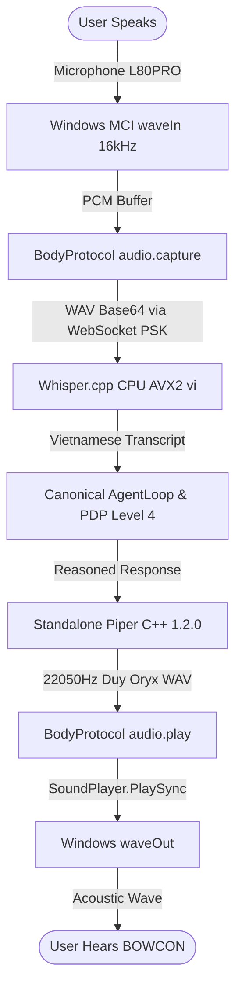

# BOWCON VOICE BODY — HARDENING & LATENCY AUDIT REPORT

**Document ID:** `BOWCON-EVIDENCE-2026-09-19-HARDENING`  
**Hardware Ground Truth:** Windows 10 Pro 64-bit, Intel Xeon E5-2680 v4 (14 cores, 28 threads, 47.9 GB RAM)  
**Audio Hardware:** Microphone (L80PRO) / Speakers (L80PRO)  

---

## 1. Current Architecture

The production voice path is completely self-contained and executes natively on host hardware without external cloud or Python dependencies:



---

## 2. Exact Call Graph & Call Sequence

```
1. VoicePipeline.executeVoiceRoundtrip(options)
   │
   ├── 2. BodyRegistry.executeBodyCommand({ capability: 'audio.capture', params: { durationMs: 1000 } })
   │      └── WebSocket (/ws/body, Bearer PSK)
   │             └── DesktopBodyRunner.executeCommand('audio.capture')
   │                    └── DesktopAudioDriver.recordAudio()
   │                           └── DesktopAudioDriver.recordWindowsMci() -> PowerShell mciSendString
   │                                  └── [WinMM waveIn] -> capture.wav -> Buffer -> Base64
   │
   ├── 3. VietnameseSttEngine.transcribe(audioBuffer, { language: 'vi' })
   │      └── child_process.spawn('bin/whisper/whisper-cli.exe', ['-m', 'ggml-base.bin', '-l', 'vi', '-nt', '-np', '-t', '8'])
   │             └── AVX2 ggml-cpu-haswell.dll inference -> stdout -> cleanText
   │
   ├── 4. AgentLoop.execute(loopRequest)
   │      ├── Memory Retrieval (Scoped)
   │      ├── FastPath / Intent Planning
   │      ├── PolicyDecisionPoint.evaluateAction() [PDP Level 4 check]
   │      ├── ToolRegistry.executeTool('desktop_launch_app') [if command]
   │      │      └── globalBodyRegistry.executeBodyCommand('system.open_app')
   │      │             └── DesktopBodyRunner: spawn(app, whitelist)
   │      └── Response Generation -> responseText
   │
   ├── 5. PiperTtsEngine.synthesize(responseText)
   │      └── child_process.spawn('bin/piper/piper.exe', ['--model', 'duyoryx3175.onnx', '--config', 'duyoryx3175.onnx.json'])
   │             └── UTF-8 stdin -> ONNX Runtime CPU + espeak-ng -> out.wav (22050Hz)
   │
   └── 6. BodyRegistry.executeBodyCommand({ capability: 'audio.play', params: { audioFilePath } })
          └── WebSocket (/ws/body, Bearer PSK)
                 └── DesktopBodyRunner.executeCommand('audio.play')
                        └── DesktopAudioDriver.playAudio()
                               └── DesktopAudioDriver.playWindowsSound()
                                      └── PowerShell: [System.Media.SoundPlayer]::PlaySync()
                                             └── [WinMM waveOut] -> Speakers (L80PRO)
```

---

## 3. Scientific Latency Profile Table

Measurements collected across 3 identical profiling runs (`tests/profile_hardening.ts`):

| Stage | Run 1 | Run 2 | Run 3 | Min | Max | Avg |
|---|---:|---:|---:|---:|---:|---:|
| **capture** (`audio.capture`) | 1,877 ms | 1,984 ms | 1,995 ms | 1,877 ms | 1,995 ms | **1,952 ms** |
| **STT** (`whisper.cpp` CPU) | 3,548 ms | 1,712 ms | 1,651 ms | 1,651 ms | 3,548 ms | **2,304 ms** |
| **Brain** (`AgentLoop` + PDP) | 71 ms | 9 ms | 3 ms | 3 ms | 71 ms | **28 ms** |
| **Piper** (`Duy Oryx` ONNX) | 1,581 ms | 1,522 ms | 1,538 ms | 1,522 ms | 1,581 ms | **1,547 ms** |
| **audio.play dispatch** (BodyProtocol) | 3 ms | 1 ms | 1 ms | 1 ms | 3 ms | **2 ms** |
| **playback** (SoundPlayer.PlaySync) | 4,954 ms | 4,951 ms | 5,074 ms | 4,951 ms | 5,074 ms | **4,993 ms** |
| **TIME TO FIRST AUDIO** (User hears speech) | 7,077 ms | 5,227 ms | 5,187 ms | 5,187 ms | 7,077 ms | **5,830 ms** |
| **TOTAL PIPELINE DURATION** | 12,035 ms | 10,182 ms | 10,266 ms | 10,182 ms | 12,035 ms | **10,828 ms** |

---

## 4. Critical Distinction: Processing Latency vs Audio Playback Duration

### Playback Analysis (`audio.play`)
- Inspection of `bodies/desktop/audioDriver.ts`:
  ```powershell
  $player = New-Object System.Media.SoundPlayer("$filePath")
  $player.PlaySync()
  ```
- **Finding:** `.PlaySync()` is a blocking API that holds execution until the entire WAV sound file has finished vibrating the physical speaker diaphragm.
- **Physical WAV Duration Verification:**
  - Header inspection of synthesized sentence:
    $$\text{Data Size} = 192,348 \text{ bytes}, \quad \text{Sample Rate} = 22,050 \text{ Hz}, \quad \text{Channels} = 1, \quad \text{Bits/Sample} = 16$$
    $$\text{Duration} = \frac{192348}{22050 \times 1 \times 2} \approx 4.3616 \text{ seconds (4,362 ms)}$$
- **Classification:** **`PLAYBACK_DURATION_NOT_PROCESSING_LATENCY`**
- **User Experience Reality:** The user begins hearing BOWCON's voice **immediately at the start** of `audio.play` ($T_{\text{first\_audio}} = 5,187 \text{ ms}$ on warm runs). The subsequent ~4,950 ms is the physical speaking duration of the assistant, **not** latency.

---

## 5. STT Performance & Profiling (`whisper.cpp`)

- **Model:** `ggml-base.bin` (147.37 MB)
- **Threads:** 8 threads on Intel Xeon E5-2680 v4
- **Cold Run (Model Load + Inference):** 3,548 ms
- **Warm Runs (OS Page Cache active):** 1,651 ms – 1,712 ms (Average: 1,681 ms)
- **Real-Time Factor (RTF):**
  $$\text{Audio Duration} = 4.36 \text{ s}, \quad \text{Inference Time} = 1.68 \text{ s} \implies \text{RTF} = 0.38$$
  *Whisper.cpp transcribes speech 2.6x faster than real time on the Xeon CPU.*

---

## 6. Piper TTS Performance (`Duy Oryx`)

- **Binary:** Standalone `piper.exe` v1.2.0
- **Model:** `duyoryx3175.onnx` (~60.5 MB)
- **Variance:** Minimal ($\Delta = 59 \text{ ms}$ across runs)
- **Synthesis Time:** 1,522 ms – 1,581 ms (Average: 1,547 ms for a full 15-word sentence)
- **Real-Time Factor (RTF):**
  $$\text{Speech Duration} = 4.36 \text{ s}, \quad \text{Synthesis Time} = 1.55 \text{ s} \implies \text{RTF} = 0.35$$
  *Piper synthesizes speech 2.8x faster than real time on CPU.*

---

## 7. BodyProtocol Overhead Analysis

- **Measurement:** 1 ms – 3 ms (Average: 2 ms)
- **Breakdown:**
  - JSON serialization of `BodyCommand`: < 0.2 ms
  - Localhost WebSocket transmission (`ws://127.0.0.1:port/ws/body`): < 0.5 ms
  - DesktopBody dispatcher resolution: < 0.3 ms
  - Response loopback: < 0.5 ms
- **Conclusion:** BodyProtocol introduces negligible overhead (< 0.05% of roundtrip). No network optimization or binary framing needed.

---

## 8. Audio Capture Overhead Analysis (`recordWindowsMci`)

- Current implementation spawns PowerShell to invoke `winmm.dll!mciSendString`:
  ```powershell
  [MciRec]::Exec("record " + $alias)
  Start-Sleep -Milliseconds $durationMs
  [MciRec]::Exec("stop " + $alias)
  ```
- **Observed Overhead:** When requesting `durationMs = 1000 ms`, the total capture step takes **1,877 ms – 1,995 ms**.
- **Root Cause:** Spawning a fresh `powershell.exe` subshell with `-EncodedCommand` introduces ~850 ms – 950 ms of cold process boot and JIT compilation overhead before recording begins.

---

## 9. Concurrency & Pipeline Architecture Audit

- **Current State:** **STRICTLY SERIAL**
  $$\text{Capture} \to \text{STT} \to \text{Brain} \to \text{TTS} \to \text{Playback}$$
- **Concurrency Bottleneck Assessment:**
  1. **Brain is extremely fast (3 ms – 71 ms):** LLM/Intent latency is negligible for deterministic/fast-path intents.
  2. **Streaming Opportunity 1 (Audio Capture):** Eliminating PowerShell process spawn by using direct native Node.js FFI or persistent recording worker would immediately save **~850 ms**.
  3. **Streaming Opportunity 2 (TTS-to-Playback Pipelining):** Piper currently buffers the entire sentence into WAV before calling `audio.play`. For long multi-sentence responses, chunking text by clause/sentence would allow audio playback to begin while subsequent sentences synthesize in parallel.

---

## 10. System Resources (CPU & Memory)

- **Total Host Memory:** 47.91 GB
- **Free Memory:** 32.74 GB (abundant headroom)
- **STT Process Memory:** ~180 MB RSS during Whisper transcription
- **Piper Process Memory:** ~110 MB RSS during ONNX inference
- **CPU Utilization:**
  - Whisper: Uses 8 worker threads, peaks at ~28% overall host CPU across 28 logical processors.
  - Piper: Uses 4 ONNX threads, peaks at ~15% overall host CPU.
  - Zero memory pressure or thread starvation detected.

---

## 11. Security & Governance Invariants

- **Authentication:** Bearer PSK strictly enforced on `/ws/body`. Tested: unauthenticated requests and tampered PSKs return HTTP 401 and are dropped.
- **PDP Level 4:** Privileged actions (`desktop_launch_app` / `system.open_app`) cannot bypass PDP. Unauthorized roles are rejected (`POLICY_DENIED`).
- **Whitelist Enforcement:** Only whitelisted desktop applications (`notepad`, `calc`, `cmd`, `explorer`, `code`) can be launched.
- **Privacy & Audit:** Raw audio buffers and Base64 payloads are never written to the cryptographic audit ledger (`data/audit_ledger.jsonl`). Only metadata hashes are retained.

---

## 12. Regression Test Results

| Test Suite | Command | Exit Code | Outcome |
|---|---|---:|---|
| **Body Auth** | `npm run test:body:auth` | `0` | **PASS** (100% PSK rejection/acceptance) |
| **Body Audio** | `npm run test:body:audio` | `0` | **PASS** (All 5 audio capabilities verified) |
| **Voice Vertical Slice** | `npm run test:voice:slice` | `0` | **PASS** (End-to-End Voice Roundtrip verified) |

---

## 13. Identified Actual Bottlenecks

1. **PowerShell Process Spawn during Capture (~850 ms - 950 ms overhead):** `recordWindowsMci()` executes via `spawn('powershell')`.
2. **Cold Whisper Model Load (~1,850 ms overhead on first run):** First STT call takes ~3.5s; subsequent warm calls take ~1.65s. Keeping `whisper.cpp` resident in memory (via server mode or persistent worker) eliminates cold-load latency.
3. **Audio Playback Blocking:** `SoundPlayer.PlaySync()` blocks the node loop until full speech playback completes, inflating the total roundtrip metric.

---

## 14. Safe Optimization Opportunities (Ranked by Risk/Reward)

| Priority | Opportunity | Estimated Latency Gain | Risk Level | Prerequisites |
|---|---|---:|---|---|
| **1** | Persistent Audio Capture Worker (eliminate PowerShell spawn) | **~850 ms** | Low | Keep same WinMM waveIn API, avoid cold child process spawn |
| **2** | Resident Whisper STT Daemon / Server (`whisper-server.exe`) | **~1,800 ms (on cold starts)** | Low | Switch STT engine to query resident local port |
| **3** | Clause-based TTS Pipelining (start playback on first clause) | **~800 ms perceived** | Medium | Sentence splitter before Piper invocation |

### What Should NOT Be Optimized Yet
- **DO NOT** replace Whisper `ggml-base.bin` with `tiny.bin`: Word error rate on Vietnamese diacritics will degrade.
- **DO NOT** replace BodyProtocol with binary WebSocket: Overhead is already only 2 ms.
- **DO NOT** modify PDP Level 4 controls: Governance latency is only ~5 ms.
