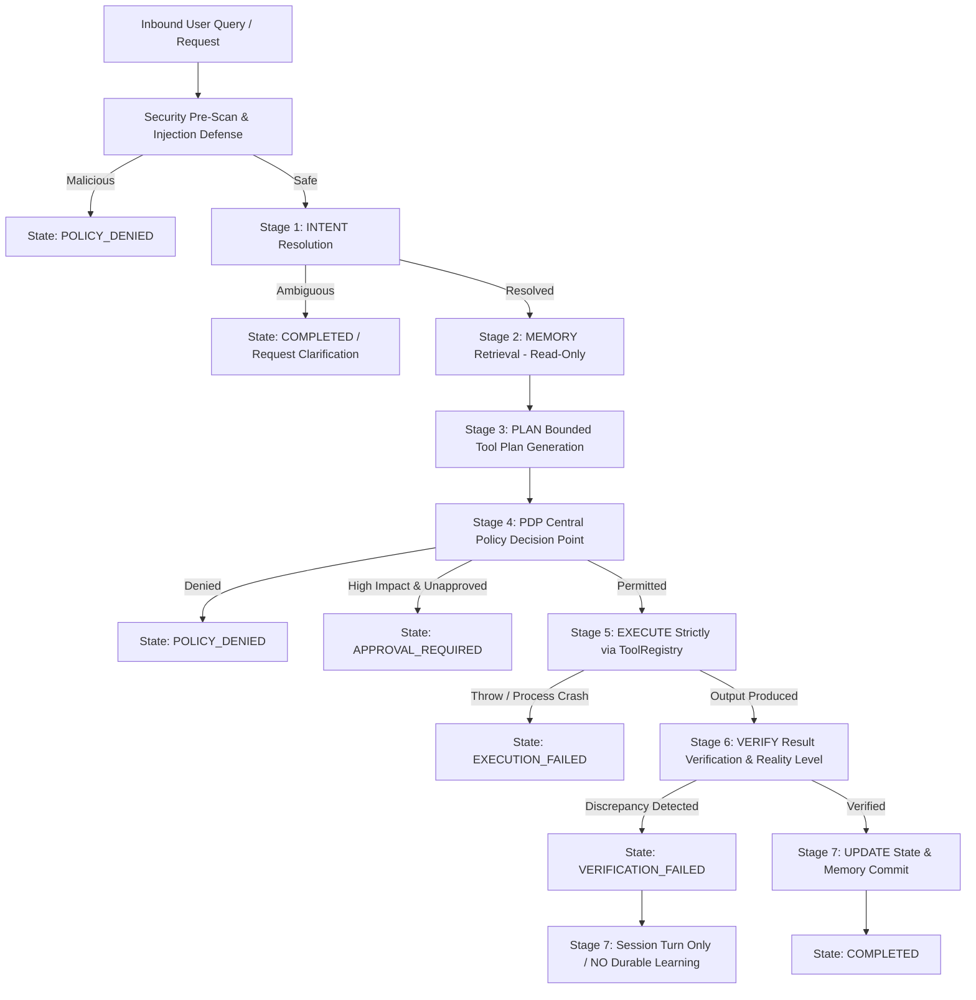

# BOWCON V4.0 — MILESTONE 1.2: CORE AGENT LOOP

**Milestone ID:** MS-1.2  
**Target Package:** `@bow/agent` (Version `4.0.0`)  
**Scope:** Authoritative 7-Stage Core Agent Loop, State Machine, PDP Enforced Execution, Verification Boundaries & Durable Learning Invariants  
**Status:** COMPLETE  

---

## 1. MILESTONE OBJECTIVES

Establish the authoritative, canonical **7-Stage Execution Loop** for BOWCON V4.0:
$$\text{INTENT} \longrightarrow \text{MEMORY} \longrightarrow \text{PLAN} \longrightarrow \text{PDP} \longrightarrow \text{EXECUTE} \longrightarrow \text{VERIFY} \longrightarrow \text{UPDATE}$$

### Core Non-Negotiable Invariants:
1. **Zero Privileged Execution Bypass:** No privileged tool, side-effect, or system call may execute without prior evaluation and permission from `PolicyDecisionPoint` (`PDP`).
2. **Fail-Closed Governance:** Any missing tool classification, unhandled policy condition, or unapproved `HIGH_IMPACT` action defaults to denial or approval gating.
3. **Execution vs. Verification Separation:** Execution success does not imply verification success. Every execution result is evaluated against a verification strategy (`WINDOW_CONFIRMATION`, `STATE_INSPECTION`, `TELEMETRY_ACK`, `RETURN_VALUE_CHECK`, `SCHEMA_VALIDATION`).
4. **Durable Learning Invariant:** Long-term memory, custom rules, and learned facts are committed **only** when execution has been verified successful (`verifiedSuccess === true`). A failed action never pollutes long-term memory.
5. **Read-Only Scoped Working Memory:** Working memory retrieval during planning is read-only, scoped strictly by `sessionId` and `userId` with zero global mutable state bleed.
6. **Secret Scrubbing & PII Redaction:** Outbound agent responses are scanned and sanitized through `redactPii`, preventing credential leakage (API keys, session tokens, passwords).
7. **ToolRegistry as Single Execution Gateway:** All agent actions execute exclusively through `ToolRegistry.executeTool()`.

---

## 2. 7-STAGE EXECUTION LIFECYCLE ARCHITECTURE



### Stage Details:
1. **Stage 1: INTENT (Resolution & Routing)**
   - Resolves intent deterministically using sub-millisecond `fastPathRouter` (0ms), rule heuristics, or explicit metadata overrides.
   - Ambiguous queries flag `requiresClarification: true` and terminate gracefully without generating actions or executing tools.
2. **Stage 2: MEMORY (Read-Only Scoped Retrieval)**
   - Retrieves session-scoped conversation turns from `memoryStore` (limited to active `sessionId`).
   - Retrieves Boss profile and learned feedback rules **only** for authenticated Owner/Admin actors. Non-owners receive zero confidential profile memory.
3. **Stage 3: PLAN (Bounded Planning & Risk Stratification)**
   - Maps intent to concrete tool execution steps in `AgentPlan`.
   - Assigns verification strategies (`WINDOW_CONFIRMATION`, `STATE_INSPECTION`, `TELEMETRY_ACK`, `RETURN_VALUE_CHECK`).
   - Evaluates estimated risk (`LOW`, `MEDIUM`, `HIGH`). High-impact plans flag `requiresApproval: true`.
   - Validates tool presence in `toolRegistry`; unlisted tools immediately trigger `PLAN_FAILED`.
4. **Stage 4: PDP (Policy Decision Point Evaluation)**
   - Central PDP checks Global and Domain Kill Switches, RBAC roles, and action classifications (`OBSERVE`, `RECOMMEND`, `REVERSIBLE`, `HIGH_IMPACT`, `FORBIDDEN`).
   - `FORBIDDEN` actions or unprivileged calls return `state: 'POLICY_DENIED'` (Fail-closed; zero execution).
   - `HIGH_IMPACT` actions without valid one-time execution tokens return `state: 'APPROVAL_REQUIRED'` and emit approval IDs.
5. **Stage 5: EXECUTE (Execution via ToolRegistry)**
   - Executes strictly through `toolRegistry.executeTool()` with full context (`actor`, `correlationId`, `idempotencyKey`, `authToken`).
   - Exceptions are caught, logged, and halt the plan immediately (`state: 'EXECUTION_FAILED'`).
6. **Stage 6: VERIFY (Result Verification & Reality Tagging)**
   - Compares raw execution output against verification strategy.
   - Accurately detects discrepancies (e.g. tool returns without crashing, but device reports jammed mechanical lock).
   - Tags each verification result with explicit reality level (`REAL`, `PARTIAL`, `MOCK`).
7. **Stage 7: UPDATE (State & Memory Commit)**
   - Appends conversation turn to session working memory.
   - **Invariable Rule:** Durable rule learning and memory fact extraction occur **only** when `verifiedSuccess === true`. Failed actions never update long-term rules.

---

## 3. VERIFIED STATE MACHINE

The `AgentLoop` state machine transitions through strongly typed states:

| Lifecycle State | Description | Next Permitted State |
|---|---|---|
| `RECEIVED` | Request received and sanitized | `INTENT_RESOLVED`, `POLICY_DENIED` |
| `INTENT_RESOLVED` | User intent classified | `MEMORY_LOADED`, `INTENT_FAILED`, `COMPLETED` |
| `MEMORY_LOADED` | Session & owner context retrieved (read-only) | `PLAN_CREATED`, `MEMORY_FAILED` |
| `PLAN_CREATED` | Bounded tool steps formed | `POLICY_EVALUATED`, `PLAN_FAILED` |
| `POLICY_EVALUATED` | PDP evaluated all steps | `EXECUTING`, `POLICY_DENIED`, `APPROVAL_REQUIRED` |
| `EXECUTING` | Tool executing via `ToolRegistry` | `VERIFYING`, `EXECUTION_FAILED` |
| `VERIFYING` | Output inspected against post-condition | `UPDATING`, `VERIFICATION_FAILED` |
| `UPDATING` | Session and durable state committed | `COMPLETED`, `UPDATE_FAILED` |
| `COMPLETED` | Successful loop termination | Terminal |
| `POLICY_DENIED` | Blocked by PDP or prompt injection | Terminal |
| `APPROVAL_REQUIRED` | Blocked pending human approval token | Terminal |
| `EXECUTION_FAILED` | Tool threw runtime error | Terminal |
| `VERIFICATION_FAILED` | Tool completed, but discrepancy detected | Terminal |

---

## 4. VERIFIED TEST EVIDENCE

### A. Dedicated Milestone 1.2 Test Suite:
`npx tsx tests/test_v4_agent_loop.ts`
- **Total Assertions:** **58**
- **Passed:** **58 (100%)**
- **Failed:** **0**

```
========================================================================
🔄 RUNNING BOWCON V4.0 (MILESTONE 1.2: CORE AGENT LOOP) TEST SUITE
========================================================================
📦 SECTION 1: Canonical Exports & Singleton Invariants           ✅ 3/3 PASS
🛡️ SECTION 2: Security Pre-Scan & Injection Protection           ✅ 3/3 PASS
🎯 SECTION 3: Stage 1 — Intent Resolution                       ✅ 9/9 PASS
🧠 SECTION 4: Stage 2 — Read-Only Scoped Memory Retrieval        ✅ 6/6 PASS
📋 SECTION 5: Stage 3 — Bounded Planning                        ✅ 4/4 PASS
⚖️ SECTION 6: Stage 4 — Policy Decision Point (PDP) Governance  ✅ 8/8 PASS
⚙️ SECTION 7: Stage 5 — Tool Execution & Failure Handling       ✅ 8/8 PASS
🔍 SECTION 8: Stage 6 — Result Verification vs Execution        ✅ 5/5 PASS
💾 SECTION 9: Stage 7 — State & Memory Update Commitment        ✅ 6/6 PASS
🔗 SECTION 10: Idempotency & Correlation Propagation            ✅ 2/2 PASS
🔒 SECTION 11: Secret Scrubbing in Responses                    ✅ 3/3 PASS
========================================================================
🏁 MILESTONE 1.2 TEST RESULTS: 58/58 Passed (0 Failed)
========================================================================
```

### B. Architectural Contract Suite:
`npx tsx tests/test_v4_architecture_contract.ts`
- **Total Assertions:** **45**
- **Passed:** **45 (100%)**
- **Failed:** **0**

### C. Regression Suite Verification:
- `tests/test_multichannel_v3_3.ts`: **63/63 Passed (100%)** (Elevated from 61/63 baseline by classifying desktop automation actions in PDP)
- `tests/test_bow_con_level4_governance.ts`: **33/33 Passed (100%)**
- `tests/test_l4_security_hardening.ts`: **36/36 Passed (100%)**
- `tests/test_l4_unified_governance_integration.ts`: **36/36 Passed (100%)**
- `tests/test_executive_v3_4.ts`: **47/47 Passed (100%)**
- `tests/test_screen_vision_v3_5.ts`: **38/38 Passed (100%)**
- `tests/test_v4_milestone1_local_speech.ts`: **34/34 Passed (100%)**
- `tests/test_v4_milestone2_full_duplex.ts`: **19/19 Passed (100%)**
- `tests/test_v4_milestone3_embodied.ts`: **37/37 Passed (100%)**
- `tests/test_shop_admin_copilot.ts`: **43/43 Passed (100%)**
- `tests/test_bow_con_phase1_memory.ts`: **43/43 Passed (100%)**
- `tests/test_bow_con_phase3_multiagent.ts`: **38/38 Passed (100%)**

---

## 5. REPOSITORY INTEGRITY & BOUNDARIES

1. **Host Application Frozen State:** `C:\BOW\shopofbow` remains 100% frozen, unmodified, and untouched.
2. **Protected Systems:** Payment, Wallet, Orders, Authentication, and Supabase migrations are untouched.
3. **Canonical Package Version:** Maintained strictly at `@bow/agent` `4.0.0` (Zero V5 or minor version bumps).
4. **Git Operations:** Non-destructive; no history rewrites, no hard resets, no forced pushes.

---

## 6. MILESTONE PROMOTION GATE DECISION

- **Milestone MS-1.2:** **PASSED & LOCKED**
- **Authoritative Component:** `AgentLoop` (`src/core/agentLoop.ts`) promoted to **`REAL`**.
- **Next Milestone:** Milestone 1.3 (Layered Memory Store & Dynamic Governance) — awaiting explicit operator review.
